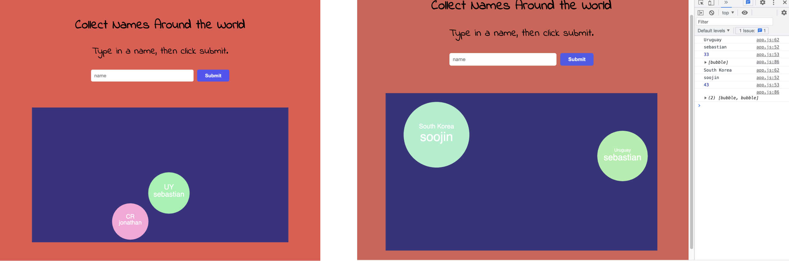
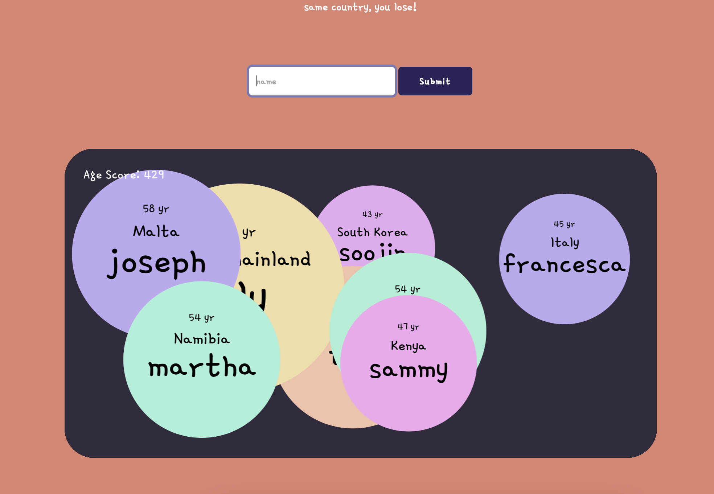
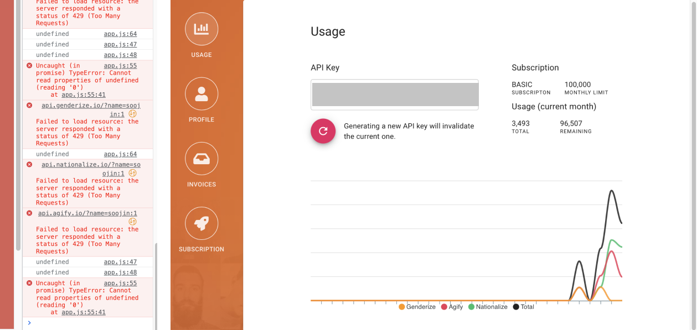
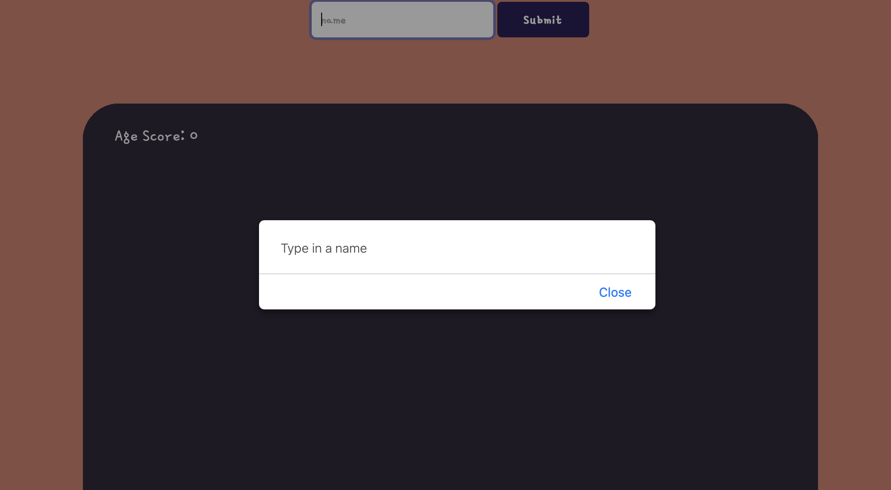
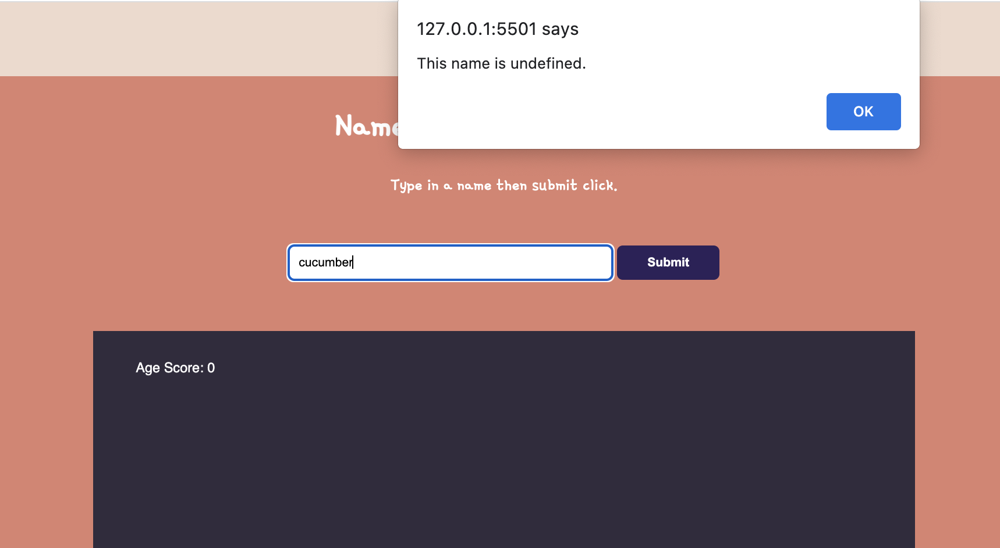
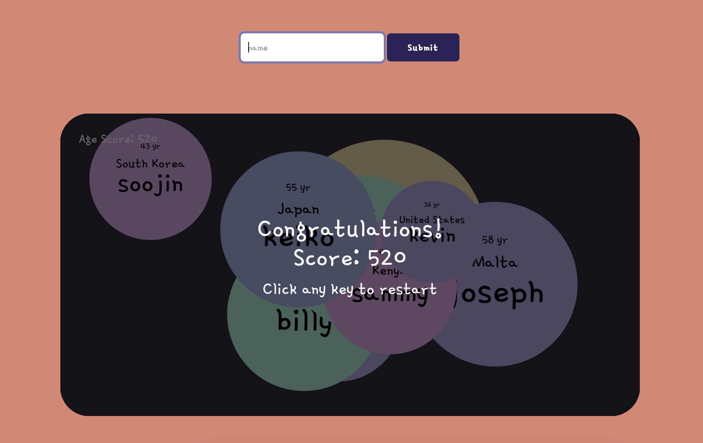
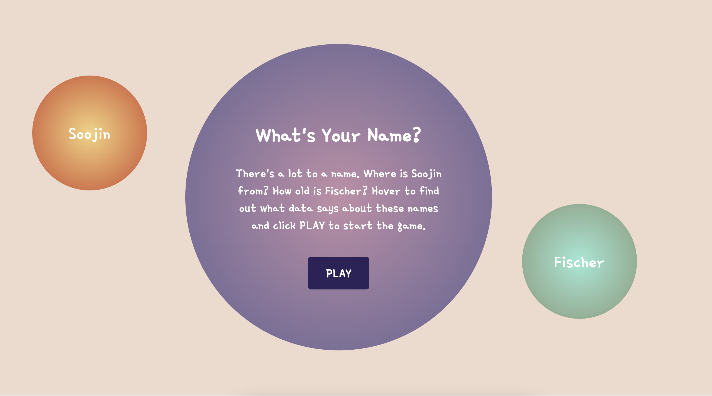

# Names Around the World 

**Title**:Identify Names Around the World <br>
**Category**: Project 1 <br>
**Date**: 9 Feb - 26 Feb 2022 <br>
**Deliverable**: CSS/HTML/Javascript/API WebGame & Data Visualization <br>

[Access Project Here](https://soojin-lee0819.github.io/connectionsLab/Project1)


## Project Brief
A person's name tells a lot about one’s identity. Albeit subconsciously, once we hear names, we immediately associate the names with the name owners' genders, nationalities, and even their ages. For example, my name “Soojin” is a typical Korean female name in Korea that people who are familiar with Korean culture would immediately start making assumptions about me upon introduction. For this project, using two APIs (agify API, nationalize API), that predict the age, and the nationality of the given name, I created a data visualization game. There are two elements to this project. The first is data visualization and the second is gamification. For the data visualization part, when the players type in a name and hit submit, the data about the name (the predicted age and the predicted nationality of the name) will be displayed in the form of bubbles. Based on this data visualization, the game was built. The predicted age will be added to the player's total ‘Age Score’. When the collective Age Score is above 500, the player win! But there’s a catch: if the player enters two names from the same country, the player lose! This game is for people who are culturally conscious, curious about human diversity, or people who live in a diverse community like the community members of NYUAD. Through the process of playing, I hope players have fun finding interesting data about the names around the world but also think critically about the biases and labels that exist in names and identities.


## Inspiration

When starting this project, I wanted this project to be focused on the dataset. Therefore, I started with researching APIs with interesting datasets and I came across [agify API](https://api.agify.io/?name=michael), a simple API for predicting the age of a person given their name. I found this API really cool because I recently read an article, about [The 50 best baby names of 2022](https://www.today.com/parents/babies/most-popular-baby-names-2022-rcna14922), and was surprised to find out how names also have trends just like how popular fashion styles change over time. It also got me to think critically about how we immediately start to profile others' identities when we are introduced with names. Although we don't think about it often, names are a huge part of our identities - a linguistic label that is put on us. Therefore, names can provide significant information or assumptions about us - whether it be nationality, gender, or age. Interested in these sociolinguistic aspects of names and the associated data, I decided to create a website that makes beautiful visualizations of the data associated with names and allows users to interact with those data with some fun game mechanics. 

## Data & API

For this project, I am using three APIs which are: 

[agify API](https://api.agify.io/?name=michael) - An API for predicting the age of a person given their name.

[nationalize API](https://nationalize.io) - An API for predicting nationality from a name.

[gender API](https://genderize.io/?gclid=EAIaIQobChMIsfmD9dP_9QIVCcPVCh1d1gvhEAAYAiAAEgIeFfD_BwE) - An API to predict the gender of a person given their name

I would like to mention that these datasets have biases and assumptions about people. Therefore, the use of data in this project is not to have a perfect understanding of the demographics or to classify people into cookie-cutter categories. However, the focus is on making a meaningful visualization of data associated with names and providing a fun game that allows players to explore cultural, gender, and age identities associated with names.

## Ideation

Originally, I was planning to use one API, the agify API. I started with brainstorming ideas about how to represent this data can be represented beautifully and purposefully as well as some game mechanics that engages users meaningfully. 


**Signature Generator**

When users type in the name, based on the data result, the website provides a unique signature. For example, the number of the age determines the color values, size of the font, font-family etcetera. 

**Find the Youngest Name**

In this challenge-style interaction, users are invited to find the youngest name. It was difficult to find names with young ages. Most of the names were between 30-60, and I couldn't find any name that is predicted to be a teenagers' name. This may be because of the nature of how the data is collected - finding the average age of all the ages associated with the name. 

**Visualizing Name & Age**

To make the visualization intuitive, I wanted to make the size of the bubble in proportion to the predicted age of the names. In this way, players can easily compare different names and ages. 

**Family Tree**

I thought it would be interesting to make a website where the users type in their family members' names and receive a family tree based on the predicted age of the names. 

**Who's Older?**

This is an interactive game where players are given two name cards and they have to guess which name has an older predicted age. 

## Wireframe

### Wireframe Week 1


<br><br>

In Week1, I created a simple wireframe focusing on how users input, and how the data would be visualized as an output. On top, there is a title, description, and an input section where users can enter names. Below is a canvas where the data about the names are visualized. 

### Wireframe Week 2


On Week2, I refined the wireframe. There are 2 sections: the landing page section and the game page section that are joint with a scroll function. 

Section 1(Landing page) - the big bubble in the center briefly introduces the project and invites players to interact with sample data visualizations. Sample data are visualized in the two bubbles on the side. Once, the players have finished exploring example data visualizations, they click the "PLAY" button, which will lead them to the game page. 
<br>
Section 2(The Game page) The game page consists of three parts: the instruction section, user input section, and the data visualization section. The score is represented on the top left corner of the game screen. My goal when designing a wireframe was to use minimal UI to allow players to focus on the visualized data without being distracted by the supporting components.


## Visual Design Choices


I focused on the consistency of the perceived feeling when making choices for visual design. I wanted the website to look bubbly, cute, and comforting. For the font, I used "Gamja Flower" - one font throughout the web. For colors, I used many colors but all of them are pastel-based colors. For the shape, since the main visualization is the circle shape, I used lots of curves and rounded the edges of the boxes to make the website look more bubbly and soft. For the landing page, inspired by Yeji's beautiful color gradient project, I added gradients to the circles to add some whimsical components to the design. 


## Process & Challenges

### Fetching API 
Fetching API was the first step for this project. I explored two methods. 

**Method1**

My first attempt was to fetch API directly from p5.js using **httpGet()** to get **response** data. 

```

function nameSubmit() {
 
  let ageurl =
    'https://api.agify.io?name=' + name;
 
  httpGet(ageurl, 'json', false, function (response) {
    resultAge = response;
  });
 
  // Log the received data to console
  console.log(resultAge);
}
 
 ```
 
 **Method2**
 
 Method 1 was working fine. However, I was recommended to use **fetch()** function to bring json data from API. So I did the coding with **fetch()** function to fetch a resource from the network, followed by returning **Response** to the request. 
 
 ```
 function nameSubmit(){
 
  let name = document.querySelector("#name").value;
  
    ageurl = 'https://api.agify.io?name=' + name';
    
    fetch(ageurl)
  .then(response => response.json())
  .then((ageData) => {
    resultAge = ageData.age;
    console.log(resultAge);
      })    
      }
 ```   
 
 <br><br>
 
  **Can't Preload**
  
Another challenge was at bringing the user input before requesting **fetch()**. Since the data should be fetched according to the user input, json file shouldn't be **preloaded()**. The file has to be brought upon an event- when the user type in a name and clicks the submit button. 
 
 <br>
 
### Spawning Bubbles - Class & Arrays of Objects

I learned how to create [class()](https://www.youtube.com/watch?v=T-HGdc8L-7w) and make [Arrays of Objects](https://www.youtube.com/watch?v=rHiSsgFRgx4
). I then used these to visualize data in the form of bubble shape. I saved the Bubble class as a seperate bubble.js file to keep the code more organized. The most challenging part for creating bubble object was to understand the concept of constructor().
<br>

```
  //Construct bubble object
  constructor(name,age,count,x,y,speed) {

  //Create Random Pastel Color
  let hue = Math.floor(Math.floor(Math.random() * 360));
  let randomColor = `hsl(${hue}, 70%, 80%)`;

      //resultName
      this.n = name;
      //resultAge
      this.a = age;
      //resultCountry
      this.c = count;
      //color is randomly selected from the pastel color range
      this.color = color;
      //x-position 
      this.x = x;
      //y-position 
      this.y =y;
      //speed of x and y
      this.xspeed = speed;
      this.yspeed = speed;
      this.randomcolor = randomColor;
    }

    
  ```
  
<br>

### Bubbles Position & Animation
<br>
 
 <br>
 The bubbles were displayed but they were not positioned within the canvas. I had to calculate the radius of each circle and add/subtract it to the min/max width/height value to make sure it is positioned within the canvas size. I also added the animation to bubbles where the bubbles are moving and bounce back when it hits the wall. Changing direction was done by reverting speed value from -1 to 1 or vice versa.
 
 <br> <br>
 
 ```
     move() {
      let halfr = this.a*2;
      if(this.x > (width-halfr)) {
        this.xspeed = this.xspeed * -1;
      }
      else if(this.x < halfr) {
        this.xspeed = this.xspeed * -1;
      }
      
      if(this.y > (height-halfr)) {
        this.yspeed = this.yspeed * -1;
      }
      else if(this.y < halfr) {
        this.yspeed = this.yspeed * -1;
      }
      
      this.x = this.x + this.xspeed;
      this.y = this.y + this.yspeed;
  
  }
 ```
 <br>
 
 ### Region Code to Full Country Name
 
  
  <br>
  
Since the data is visualized directly from the json data, the country name is saved as a region code. This code is legible and efficient for the computer, but it is not friendly for the users. At first, I thought it is kind of fun exercise to guess what country the two letter represents. However, after some play-testing, I found out that people find it very difficult to make understanding of what the region code represents. Therefore, I decided to change this region code to more legible form. Initial attempt was to change the region codes to the flag icons. However, I couldn't find the dataset with all flags around the world. Instead, I used **Intl.DisplayNames** https://developer.mozilla.org/en-US/docs/Web/JavaScript/Reference/Global_Objects/Intl/DisplayNames to change the region code to full country name. 

<br>

```
let regionNamesInEnglish = new Intl.DisplayNames(['en'], { type: 'region' });

```

```
   resultCountryFull = regionNamesInEnglish.of(resultCountry);
```
<br>


 ### Playtesting
 
   
<br>

 I did play-testing on Tuesday 22, Feb. I showed my MVP of the game - Some of the feedback received were:<br>
 
 1) I would like to read some context before playing the game <br>
 2) What if the player enter the name that is not valid such as "pencil?"
 <br>
 Based on this feedbacks, I continued coding...
 
 <br>
 
 ### Limited Access to API 
 
   
   
   I was confused when I suddenly started receiving an error messages that says "failed to load resource". I spent hours trying to fix my code but I still couldn't find the issue. I found out that the issue was not at the code it self but there is a limit to the number of names that I can search using this API. In order to search more than 1000 names a day, I had to buy API key. With this API key the fetch url had to be modified as well. 
   
   ```
     ageurl = 'https://api.agify.io?name=' + name + '&apikey=275c8c5db6b62a979b8b4ac71ab76af0';
     
```
 
 
 ### Error Prevention
  
 
Show an alert when the name is submitted without any input

```
 //Error alert: If there is no entry for name show alert
  if (document.querySelector('#name').value.length == 0) {
    alert('Type in a name');
   }

```



Also show an alert when the input name is invald (no existing data for the input name)


```
    //Error alert: if this name is undefined, show alert
    if(nationalData.country[0]==undefined) {
      alert('This name is undefined.');
    };
```


 ### Check Duplicate Country
 
When the name with the same predicted nationality is entered, the game ends with an alert 'game over' and the page is refreshed to restart. 
<br>

 ```
 //Check if there is a country duplicate
function checkDuplicate(){
   let result = false;
   // go through the Country array
   for(let i = 0; i < Countries.length;i++) {
      // compare the first and last index of an element
      if(Countries.indexOf(Countries[i]) !== Countries.lastIndexOf(Countries[i])){
         result = true;
         // terminate the loop
         break;
      }
   }

   //if there is duplicate
   if(result) {
      console.log('Array contains duplicate elements');
      //the game is over and restart the game
      alert('Game Over');
      document.location.reload();
   } else {
      console.log('Array does not contain duplicate elements');
   }
}

```

<br>
 
At first, the concept of Array was unfamilia. How to compare object within the array to the reset of the objects in the array was also confusing. However, after successfully coding this part, I started to feel like I am confident with using Array.
<br>

 ### Add Score System & Construct "End Page"
 
   
   
I added scoring system and constructed the end page that only shows up when the accumlated score is above 500. I used boolean() function to bring the endpage when the gameDone becomes true.

When the game is ended, I wanted the players to still be able to see the data visualization. Therefore, I adjusted opacity of the background to make the bubbles visible, along with the Congratulations! card.
 

 ### Add Landing Page
 
       
       
 I added Landing page onto the Game Page. Here, I focused on the meaningful and unique design. Instead of following typical website wireframe with the navigation bar on top, I wanted the interaction to be unique and intuitive for the players. Here, users are invited to explore how the data is visualized by themselves instead of giving instructions. They can hover on the example data visualization of the name "Soojin" and "Fischer" to learn more about the concept of this project and have better understanding of the dataset.
 

## Reflection & What's Next?

### Level Design

When I was playing the game, collecting 500 points wasn't too difficult. This is because I grew up with a diverse upbringing. However, I know that people who grew up in a more homogenous cultural background would find this game more difficult. For this reason, I want to add a feature where the players can select the level of the game by adjusting the points they have to earn to win. 

### Show Analytics on Game Over

I want to improve the endgame page by adding analytics. For now, it just shows the final score. I want to add more analytics - such as the name that is predicted the oldest, and the list of the countries the players collected. 

### Add Feedback Section

I want to add a feedback section where the players can share some findings and insights. For instance, what are some of the names they couldn't find, or what are the names that they find the information to be inaccurate? This way, we can educate each other and work collectively to find out more about the existing biases in data, specifically name-related data. With this knowledge gained, we can make more conscious judgments and educated decisions when we are interacting with data around us. For example, one thing that stood out to me was the most was that a lot of names that are originally from the Western world such as "Lily" were categorized as China. This may be because of the huge population in China, which means more data entry and when the numbers are compared with other countries with a smaller population, China will always have higher number.


### Reflection
Overall, I am extremely proud of this project. Although a bit daunting at first, I learned so much about applying data to produce a meaningful and fun interaction in the digital space. I am now a lot more comfortable coding with javascript and p5.js as well. One important lesson was that making a solid wireframe and writing down steps that I need to complete before coding helps grealy when I start coding. I also started to think about the power and the responsibilities of the developers in making ethical choices when processing and visualizing data. As visual animals, we believe what we see. Therefore, every decision on what we choose to include or to exclude can facilitate users understanding of the data and even steer certain behaviors. For the next project. I want to learn how to build a real-time website and build a game that allows multiple players to play together.
