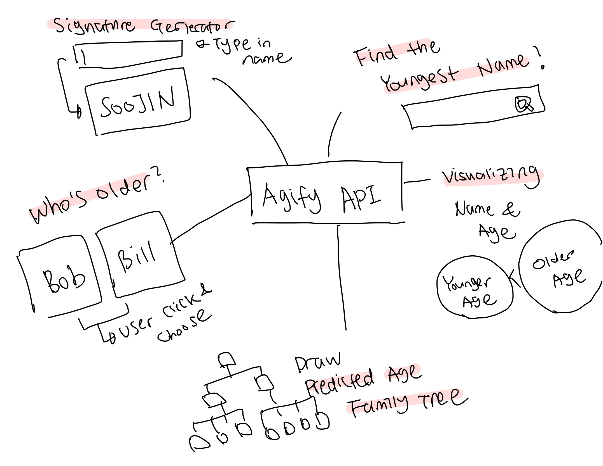
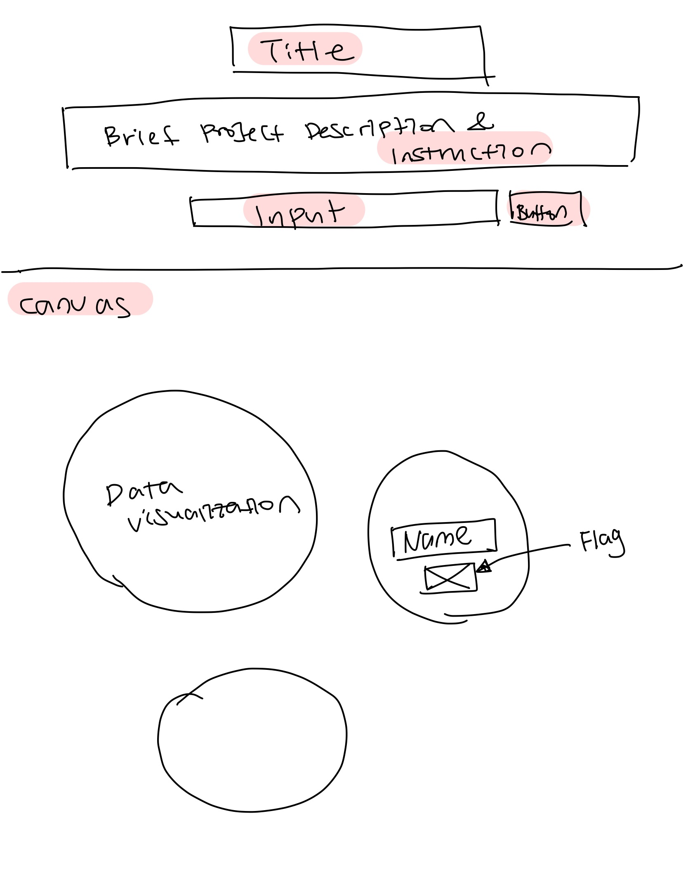
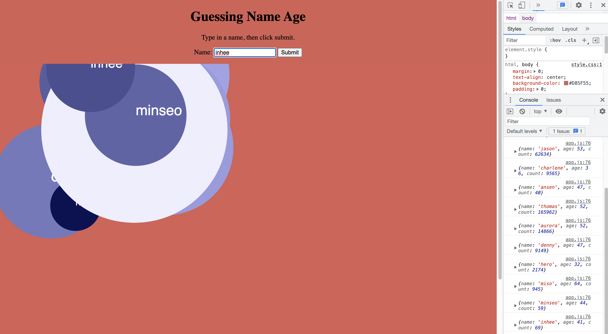

# Names Around the World 

**Title**:Identify Names Around the World  
**Category**: Project 1  
**Date**: 9 Feb - 26 Feb 2022  
**Deliverable**: CSS/HTML/Javascript/API WebGame & Data Visualization  

[Access Project Here](https://soojin-lee0819.github.io/connectionsLab/Project1)

## Project Brief
A person's name tells a lot about one’s identity. Albeit subconsciously, once we hear names, we immediately associate the names with the naem owners' genders, nationalities, and even their ages. For example, my name “Soojin” is a typical Korean female name in Korea that people who are familiar with Korean culture would immediately start making assumptions about me upon introduction. For this project, using two APIs (agify API, nationalize API), that predicts the age, and the nationality of the given name, I created a data visualization game. There are two elements to this project. The first is data visualization and the second is gamification. For the data-visualization part, players type in the name and click the submit button to receive visual data about the predicted age and the nationality of the name. For the game part, players are participating more proactively by typing in as many diverse names as possible.When a player type in a name, the predicted age and the country of each name will be displayedThe goal of this game is to score aobve 500 points. But there is a catch! If the players enter two names from the same country, they lose! This game is for people who are culturally conscious, curious about the cultures, human diversity, or people who live in a diverse community like members of NYUAD. Through the process of playing, I hope players have fun finding different names from different backgrounds but also think critically about the biases and labels that exist in names and identities.

## Inspiration

When starting this project, I wanted this project to be focused on the dataset. Therefore, I started with researching APIs with interesting datasets and I came across [agify API](https://api.agify.io/?name=michael), a simple API for predicting the age of a person given their name. I found this API really cool becasue I recently read an article, about [The 50 best baby names of 2022](https://www.today.com/parents/babies/most-popular-baby-names-2022-rcna14922), and was surprised to find out how names also have trends just like how popular fashion styles change overtime. It also got me to think critically about how we immediately start to profile others' identities when we are introduced with names. Although we don't think about it often, names are a huge part of our identities - a linguistic label that is put on us. Therefore, names can provide a significant information or assuptions aobut us - whether it be the nationality, gender, or the age. Interested in this sociolinguistic aspects of names and the associated datas, I decided to create a website that makes a beautiful visualizations of the datas associated with names and allow users to interact with those data visualization with game mechanics. 

## Data & API
For this project, I am using three APIs which are: 

[agify API](https://api.agify.io/?name=michael) - An API for predicting the age of a person given their name.

[nationalize API](https://nationalize.io) - An API for predicting nationality from a name.

[gender API](https://genderize.io/?gclid=EAIaIQobChMIsfmD9dP_9QIVCcPVCh1d1gvhEAAYAiAAEgIeFfD_BwE) - An API to predict the gender of a person given their name

I would like to mention that these datasets have biases and assumptions about people. Therefore, the use of data in this project is not to have a perfect understanding of the demographics or to classify people into cookie cutter categories. However, the focus is on making a meaningful visualization of data associated to names and provide a fun game that allows players to explore cultural, gender, and age identities associated with names.

## Process

Originally, I was planning to use one API, the agify API. I started with brainstorming ideas about how to represent this data in a visually appealing manner as well as the game mechanics that can engage users to interact with the datas in a meaningful way.

### Signature Generator
When users type in the name, based on the data result, the website provides a unique signature. For example, the number of the age determines the color values, size of the font, font-family and etcetera. 

**Find the Youngest Name**
In this challenge-style interaction, users are invited to find the youngest name. It was difficult to find names with young ages. Most of the names were between 30-60, and I couldn't find any name that is predicted to be a teenagers' name. This maybe because of the nature of how the data is collected - finding the average age of all the ages associated to the name. 

**Visualizing Name & Age**
To make the visualization intuitive, I wanted to make the size of the bubble in proportion to the predicted age of the names. In this way, players can easily compare different names and ages. 

**Family Tree**
I thought it would be interesting to make a website where the users type in their family members' names and receive a family tree based on the predicted age of the names. 

**Who's Older?**
This is an interactive game where players are given two name cards and they have to guess which name has an older predicted age. 

## Week1

  

On top, there is a title, description, and a data input section where users can type in the names. Below is a canvas where the datas are visuallized. The input names are visuallized according to the data.
  

  

For week one, I established the basic structure and successfully fetched data from three different APIs. For now the representation of the data is only based on the datas from Agify API - the size of the bubbles and the colors are determined by the data result - the predicted age of the name that user entered. 

## Next Steps

1) Associate visual representation of the bubble with nationality and gender as well. (As of now, all the variables such as colors and the sizes are manipulated by the age data).
2) Make bubbles move within the canvas to make it more visually stimulating (Add some animation).
3) Add function: Classify age data into categories (for example age between 10-20, age between 20-30) to compare.
4) Add function: Store all the output data of the userinput to compare with new entry
5) Add function: If the output data of the new input matches with the previous dataset, the game ends
6) Consider storing classes to different js files to organize code.
7) Describe project and write down instructions on how to play the game on the landing page using visual cues (minimize writing). 
8) Prevent Errors such as error message pop up when the input is submitted without any entry.

## Winning Example for Presentation
Soojin -> David -> Francesca -> lily -> Ali -> Simon -> Joseph -> Keiko -> -> Sammy -> Milena 
