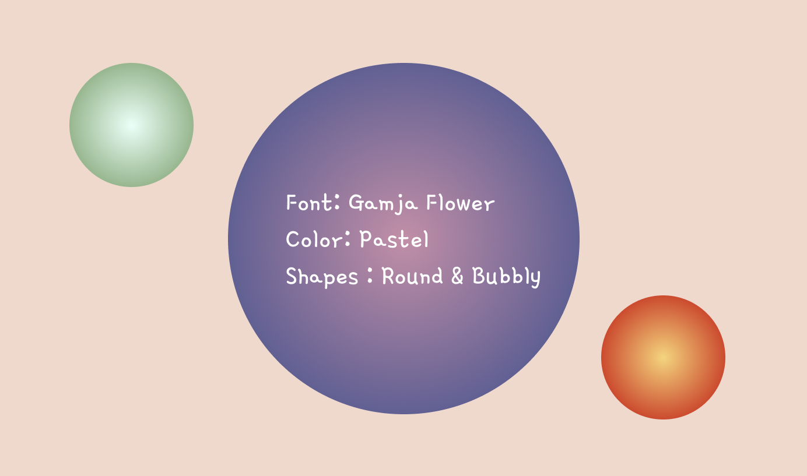

# Names Around the World 

**Title**:Identify Names Around the World <br>
**Category**: Project 1 <br>
**Date**: 9 Feb - 26 Feb 2022 <br>
**Deliverable**: CSS/HTML/Javascript/API WebGame & Data Visualization <br>

[Access Project Here](https://soojin-lee0819.github.io/connectionsLab/Project1)


## Project Brief
A person's name tells a lot about one’s identity. Albeit subconsciously, once we hear names, we immediately associate the names with the naem owners' genders, nationalities, and even their ages. For example, my name “Soojin” is a typical Korean female name in Korea that people who are familiar with Korean culture would immediately start making assumptions about me upon introduction. For this project, using two APIs (agify API, nationalize API), that predicts the age, and the nationality of the given name, I created a data visualization game. There are two elements to this project. The first is data visualization and the second is gamification. For the data visualization part, when the players type in a name and hit submit, the data about the name (the predicted age and the predicted nationality of the name) will be displayed in forms of bubbles. Based on this data visualization, the game was built. The predicted age will be added to the player's total ‘Age Score’. When the collective Age Score is above 500, the player win! But there’s a catch: if the player enter two names from the same country, the player lose! This game is for people who are culturally conscious, curious about human diversity, or people who live in a diverse community like the community members of NYUAD. Through the process of playing, I hope players have fun finding interesting datas about the names around the world but also think critically about the biases and labels that exist in names and identities.

## Inspiration

When starting this project, I wanted this project to be focused on the dataset. Therefore, I started with researching APIs with interesting datasets and I came across [agify API](https://api.agify.io/?name=michael), a simple API for predicting the age of a person given their name. I found this API really cool becasue I recently read an article, about [The 50 best baby names of 2022](https://www.today.com/parents/babies/most-popular-baby-names-2022-rcna14922), and was surprised to find out how names also have trends just like how popular fashion styles change overtime. It also got me to think critically about how we immediately start to profile others' identities when we are introduced with names. Although we don't think about it often, names are a huge part of our identities - a linguistic label that is put on us. Therefore, names can provide a significant information or assuptions about us - whether it be the nationality, gender, or the age. Interested in this sociolinguistic aspects of names and the associated datas, I decided to create a website that makes a beautiful visualizations of the datas associated with names and allows users to interact with those data with some fun game mechanics. 

## Data & API
For this project, I am using three APIs which are: 

[agify API](https://api.agify.io/?name=michael) - An API for predicting the age of a person given their name.

[nationalize API](https://nationalize.io) - An API for predicting nationality from a name.

[gender API](https://genderize.io/?gclid=EAIaIQobChMIsfmD9dP_9QIVCcPVCh1d1gvhEAAYAiAAEgIeFfD_BwE) - An API to predict the gender of a person given their name

I would like to mention that these datasets have biases and assumptions about people. Therefore, the use of data in this project is not to have a perfect understanding of the demographics or to classify people into cookie cutter categories. However, the focus is on making a meaningful visualization of data associated to names and provide a fun game that allows players to explore cultural, gender, and age identities associated with names.

## Ideation

Originally, I was planning to use one API, the agify API. I started with brainstorming ideas about how to represent this data can be represented beautifully and purposefully as well as some game mechanics that engages users meaningfully. 


**Signature Generator**

When users type in the name, based on the data result, the website provides a unique signature. For example, the number of the age determines the color values, size of the font, font-family and etcetera. 

**Find the Youngest Name**

In this challenge-style interaction, users are invited to find the youngest name. It was difficult to find names with young ages. Most of the names were between 30-60, and I couldn't find any name that is predicted to be a teenagers' name. This maybe because of the nature of how the data is collected - finding the average age of all the ages associated to the name. 

**Visualizing Name & Age**

To make the visualization intuitive, I wanted to make the size of the bubble in proportion to the predicted age of the names. In this way, players can easily compare different names and ages. 

**Family Tree**

I thought it would be interesting to make a website where the users type in their family members' names and receive a family tree based on the predicted age of the names. 

**Who's Older?**

This is an interactive game where players are given two name cards and they have to guess which name has an older predicted age. 

## Wireframe

### Wireframe Week 1


<br><br>

On Week1, I created a simple wireframe focusing on how user input, and how the data would be visualized as an output. On top, there is a title, description, and an input section where users can enter names. Below is a canvas where the data about the names are visuallized. 

### Wireframe Week 2


Week2, I refined the wireframe. There are 2 sections: the landing page section and the game page section that are joint with a scroll function. On landing page, the the big bubble in the center briefuly introduces the project and invites players to interact with sample data visualizations. Sample data are visualiezd in the two bubbles on the side. Once, the players have finished exploring example data visualizations, they click "PLAY" button, which will lead them to the game page. 
<br>
The game page consists of three sections: the instruction section, user input section, and the data visualization section. The score is represented on the top left corner of the game screen. My goal was to use minimal UI to allow players to focus on the visualized data without being distracted by the surrounding instructions.


## Visual Design Choices


I focused on the consistency and the perceived feeling when making choices for visual design. I wanted the website to look bubbly, cute, and comforting. For the font, I used "Gamja Flower" - one font throughout the web. For colors, I used many colors but all of them are pastel-based colors. For the shape, since the main visualization is the circle shape, I used lots of curves and rounded the edges of th boxes to make the website look more bubbly and soft. For the landing page, inspired by Yeji's beautiful color gradient project, I added gradients to the circles to add some whimsical component to the design. 


## Process & Challenges

### Fetching API 
Fetching API was the first step for this project. I explored two methods. 

**Method1**

My first attempt was to fetch API directly from p5.js using **httpGet()** to get **response** data. 

```

function nameSubmit() {
 
  let ageurl =
    'https://api.agify.io?name=' + name;
 
  httpGet(ageurl, 'json', false, function (response) {
    resultAge = response;
  });
 
  // Log the received data to console
  console.log(resultAge);
}
 
 ```
 
 This was a working code. However, I was recommended to use **fetch()** function to bring json data from API. So I recoded with **fetch()** to fetch a resource from the network, with a return **Response** to the request. 
 
 ```
 function nameSubmit(){
  let name = document.querySelector("#name").value;
    ageurl = 'https://api.agify.io?name=' + name';
    fetch(ageurl)
  .then(response => response.json())
  .then((ageData) => {
    resultAge = ageData.age;
    console.log(resultAge);
      })
 
 <br><br>
 Another challenge was at bringing the user input before requesting **fetch()**. Since the data is brought according to the user input, the name the user types in, json file can't be **preloaded()** but has to be brought upon an event, clicking submit button. 


<br><br>

For week one, I established the basic structure and successfully fetched data from three different APIs. For now the representation of the data is only based on the datas from Agify API - the size of the bubbles and the colors are determined by the data result - the predicted age of the name that user entered. 


### Change Country Code to Full Name
https://developer.mozilla.org/en-US/docs/Web/JavaScript/Reference/Global_Objects/Intl/DisplayNames


## Next Steps

1) Associate visual representation of the bubble with nationality and gender as well. (As of now, all the variables such as colors and the sizes are manipulated by the age data).
2) Make bubbles move within the canvas to make it more visually stimulating (Add some animation).
3) Add function: Classify age data into categories (for example age between 10-20, age between 20-30) to compare.
4) Add function: Store all the output data of the userinput to compare with new entry
5) Add function: If the output data of the new input matches with the previous dataset, the game ends
6) Consider storing classes to different js files to organize code.
7) Describe project and write down instructions on how to play the game on the landing page using visual cues (minimize writing). 
8) Prevent Errors such as error message pop up when the input is submitted without any entry.


## Spoiler Alert!
### One example of winning the game 
Soojin -> David -> Francesca -> lily -> Ali -> Simon -> Joseph -> Keiko -> -> Sammy -> Milena 

## What's Next?

### Level Design

When I was playing the game, hitting 500 point was rather easy. This is because I have a diverse upbringing and I know many names around the world who are very diverse. However, I know that for people who grew up in more homogenous cultural background would find this game difficult. For this reason, I want to add a feature where players can select the level of the game (easy, difficult, and 
