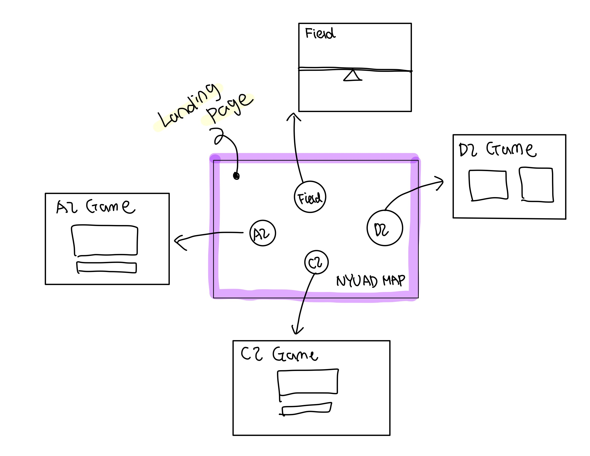
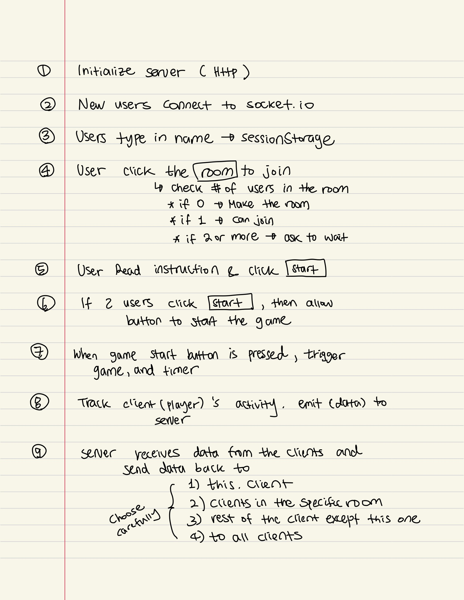
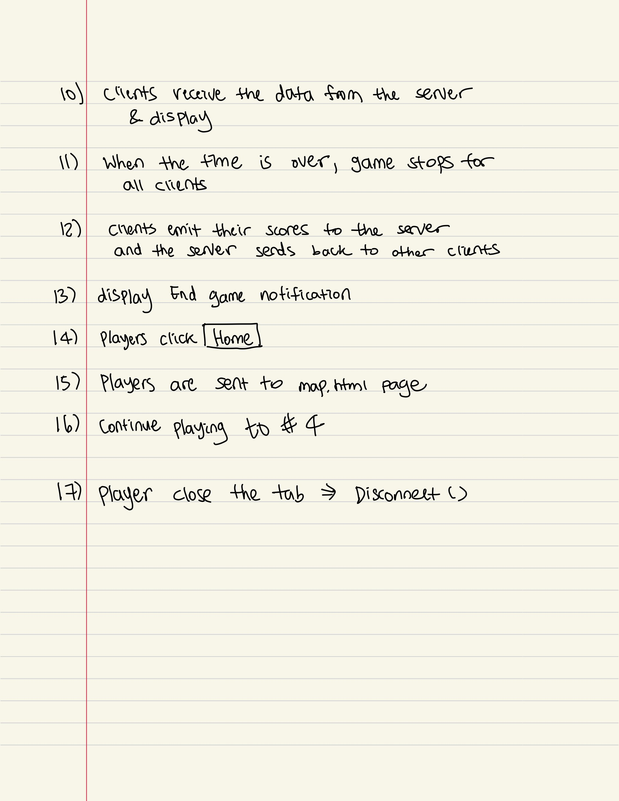
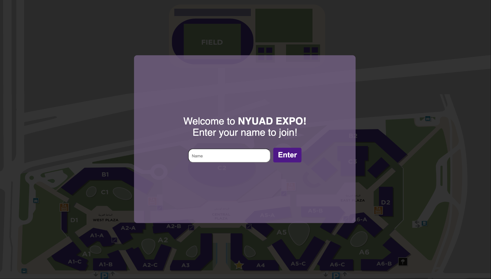
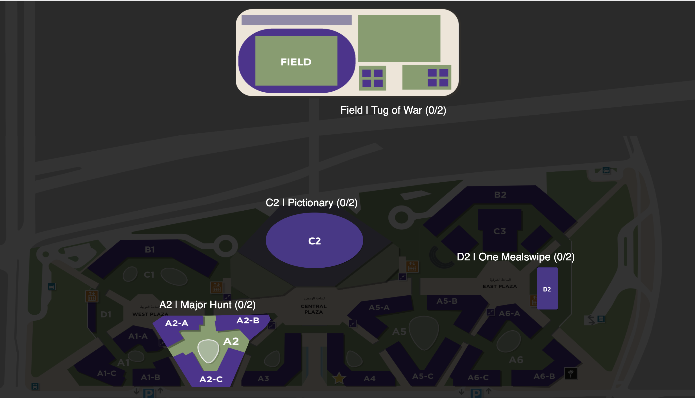
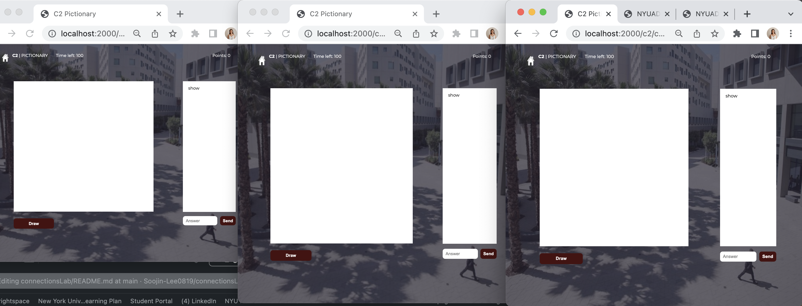
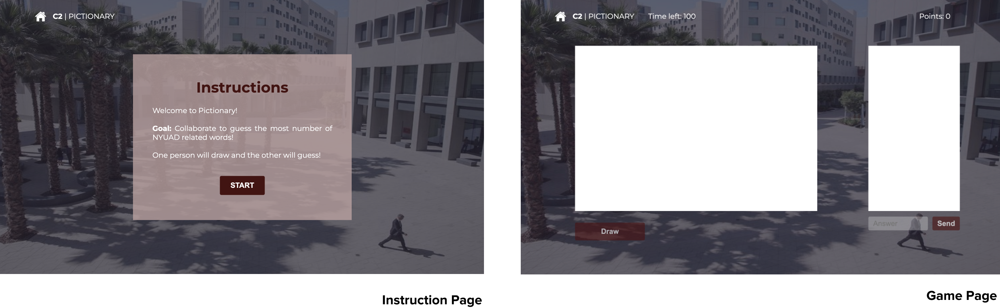
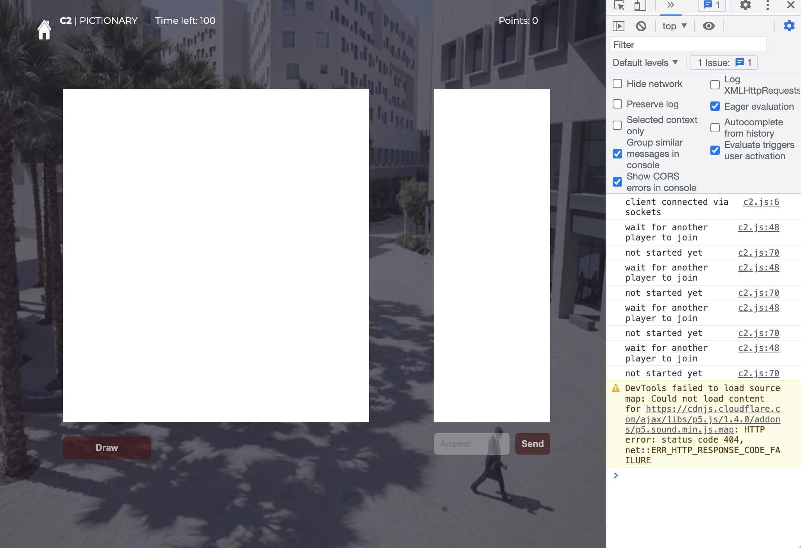
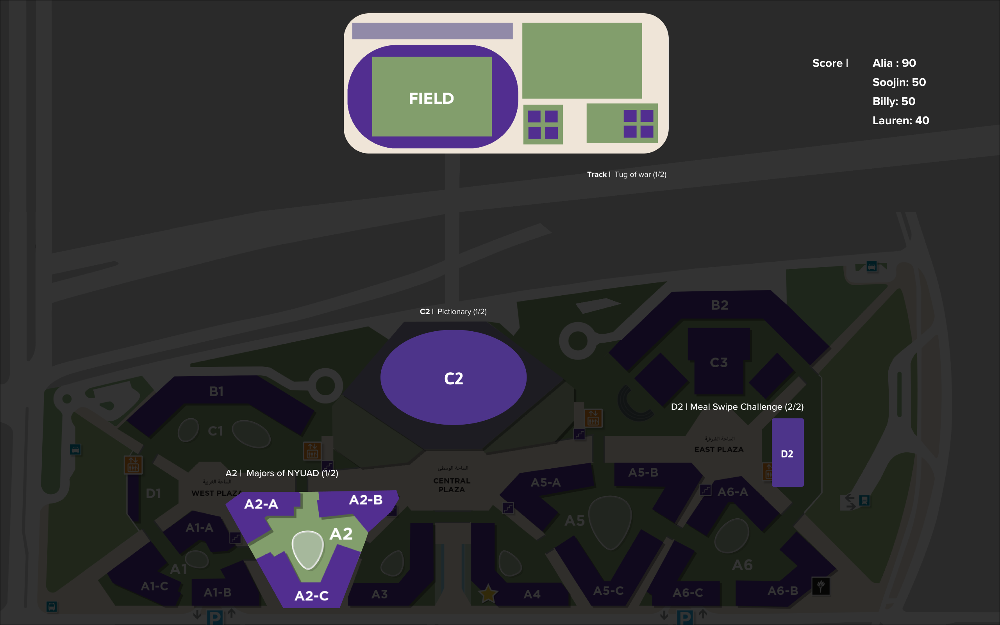

# NYUAD Expo

**Title**:NYUAD Expo <br>
**Category**: Project 2 <br>
**Date**: 1 April 2022 -11 April 2022 <br>
**Group**: Soojin Lee | Alia Waleed <br>
**Deliverable**: CSS/HTML/Javascript/p5.js/Socket.IO Multiplayer Web Game <br>

[Access Project Here](https://soojin-lee0819.github.io/connectionsLab/Project1)


### Project Brief 

This game is inspired by Expo 2020 where the visitors go around different pavilions to experience the unique culture of countries around the world. Similarly, in this game, players would explore the campus of NYUAD while visiting different campus pavilions including D2, C2,  A2, and the Field. In each pavilion, the players would play a different 2-player game. 

On the landing page, there would be a map of campus with 4 clickable locations as well as the total number of players inside each pavilion. The players pick the pavilion of their choice and get redirected to a specific game page. At the Track & Field pavilion, players can play tug of war against each other. At the C2 admissions office, players can play a game where they need to collectively write down all majors on campus, and if they write the same major twice, they lose. The third pavilion is D2, where players are given an order and their goal is to complete as many orders as possible (the gameplay mechanism will be a click and pick). The last pavilion is a classroom in A2 where the players would play Pictionary. 

### Inspiration 


### Wire Frame
This is the initial wireframe I made focusing on the structure of the webpage and how users' would access each game. On landing page, users will be given the map of NYUAD with the locations highlighted to enter. When users click the location, they will be directed to the according game page. <br> <br>



<br> <br>

Using figma, I have designed the landing page. At first, I used the 3D modelling map of NYUAD. Here, I added location pin with the real-life images of the location in the shape of bubble. After discussing with Alia, we decided to use the 2D map of NYUAD with the part of the map highlighted. 

 <br> <br>

We also designed the quick mockup of each game room to make sure the visual interface is consistent throughout the game. Although each game has its own unique features, by making the background consistent with image overlay and the title on the top, we made sure that the game feels - one big game with four minigames, rather than four separate games. 

<br> <br>


### Developing Game Mechanics 

The basic game mechanics of the two minigames are from our previous assignment - C2 | Pictionary from my [NYUAD Pictionary](https://bustling-tortoiseshell-citrine.glitch.me) and D2 | Tug or War from Alia's previous [Tug of War](https://tug-of-war-alia.glitch.me) game. Two other games were ideated in relation to the purpose of locations. For D2 (school cafeteria), inspired by burger making game, we decided to create a game where the players are given with order and need to click images of the D2 food to complete an order. For A2, we wanted to make a game where the players are asked to remember and type in the majors at NYUAD as quickly as possible. 

Following are the list of games available at NYUAD Expo:

1) A2 | Major Hunt
1) C2 | Pictionary
2) D2 | One MealsSwipe
3) Field | Tug of War


### Coding & Challenges

The most challenging part of this project was definitly the coding part. Some game mechanics had to be adjusted so that it is managable for us to code. For instance, instead of making the room open for everyone, we have set the limit of the players to be 2 players max. Alongside implementing the game itelf, we did many error checkings. I have learnt from this project that to create a game where the multiple players are playing realtime, there needs to be a lot of error checkings than a game for a single player. 


### Workflow




### Session Storage



Once the user joins the game, on landing page they are asked to enter their names. The entered name is saved in session storage. 

<b> landingPage.js </b> 
  
````
   joinForm.addEventListener('submit', (e) => {
      e.preventDefault();
      let name = document.getElementById('name-input').value;
      //save the name and the room in session storage
      sessionStorage.setItem('name', name);
    })
````
User connects to socket.io and is given with socket id. The user name, and the socke.id is paired at index.js file. <br><br>

### Map | Join Room



On map tab, users can click on the map to join the room. This function will redirect the user to (roomName).html The information about which room to join is also saved as session storage and emitted to the server.  <br><br>

<B> map | script.js</b> <br>

````
function joinRoom(img) {
    let room = img.id;
    //redirect the user to game.html
    console.log(room);
    if (room == 'Field') {
      window.location = '/field/field.html';
    }
    else if (room == 'A2'){
      window.location = '/a2/a2.html';
    }
    else if (room == 'C2'){
      window.location = '/c2/c2.html';
    }
    else if (room == 'D2'){
      window.location = '/d2/d2.html';
    }
    else{ //to be changed
      alert("not available")
    }
    sessionStorage.setItem('room', room); //save to session storage
}
````
  
<br>
  
Here, the user's name is paired with their socket.id and depending on the number of players in the room, following happens to the player<br>
1) The room is created (when 0 player is in the room), 
2) added to the room (when 1 player is in the room), 
3) or asked to wait (when more than 2 players are in the room). <br><br>


  
<b> Server | index.js</b> <br>

````
 socket.on('userData', (data) => {
        //save username in an array with their ID
        socket.name = data.name;
        users[socket.name] = socket.id;
        console.log(users);

        //let the socket join room of choice
        socket.roomName = data.room;

        socket.join(socket.roomName);
        if (rooms[socket.roomName]) { //if room exists
            // do not increment if there are 2 people in the room 
            if (rooms[socket.roomName] == 2) {
                console.log("Client > 2: ", socket.id);
                socket.emit('morePlayers', '');
            }
            else{
                rooms[socket.roomName]++;
            }
        } else {
            rooms[socket.roomName] = 1;
        }
  
````
  <br>
  
  
  ### Map | Display Number of Players in each Room
  
  
  
  <br>
Also when the client joins the room, the number of the players in each room are sent to the map to be displayed. For example, on the image above there is one player at C2. 
  
  <br><br>
  
  <b> Server | index.js</b> <br> 
  
  ````
  // get the number of players in each room and send to map
        let A2 = rooms["A2"];
        let C2 = rooms["C2"];
        let D2 = rooms["D2"];
        let Field = rooms["Field"];

        io.in("map").emit("A2PlayerNum", A2);
        io.in("map").emit("C2PlayerNum", C2);
        io.in("map").emit("D2PlayerNum", D2);
        io.in("map").emit("FieldPlayerNum", Field);
  
  ````
  
 ### Map | Error Checking - Unresolved
  
However, there is an error that is still unresolved. When the new client joins, the displayed number of players at each room is accurate. However, when the player returns to the map after joining the room, whether after completing the game or through clicking the home button, the number of client in each room is no longer accurate. The number of players in all the rooms are set to 0. This also means that when the user returns to the map page more than 2 players can join the same gameroom. We didn't know how to fix this issue. It is not only the display error but the number is not updated on the server side as well. 
 
Through more error checkings, I found out that when the user is fully disconnected by closing the tab, or joins another room on the map, it gets updated. Below shows how the three players can join the room after returnning to the map by cliking home button.
 
 
   

### GAME | 2 PAGES (Instruction + Play Game)

Originally, the instruction was going to be on the game page itself. However,due to the limited space, we added an instruction page where the players are prompted to read the instruction and click the **start** button before they enter the game. 

  <br><br>
 
Since the games are time-based, when there is only one player in the room, they shouldn't be able to start the game. It would be unfair when one player starts typing in the word while the other player is still reading the instruction. Therefore, we added the code where on window "load", it checks if there are two players in the game, and have read the instruction. If there is only one player even, when the player clicks **Start** the timer is not triggered nor the buttons or the input boxes are working.
 
   
  
By adding one more step: where the second player joins the room, and have clicked the **Start** Button, it sends **canStart** that allows all players to be able to access the buttons to begin the game, and the timer gets started as well. <br><br>

Although this sounds easy at first, in order to implement this was quite complicated. This is because the program has to first, track the number of the players in the room, then check if the player has finished reading the instruction, then wait for the player to click a button that starts the game (and the timer), send to all players to start running the game and timer in sync, as well as to start tracking their scores as soon as the game is started. 

<br><br>
 

### Play-Testing 

For the play testing, we had our basic game mechanics ready for testing. Our main aim for the playtesting was to check if the players are able to follow the instruction or visual cues without further help. We also wanted to see if there are any error checking that we have missed. 

**Here are some of the goals in mind:**

1) For D2 game, do they know how to delete the misplaced items with out the instructions? Is it intuitive to delete the item on the tray by clicking it again?


2) Are the instructions intuitive and easy to understand?


3) Do they want more/less time for each game?


4) Do they have fun when playing the game? (Are the games too difficult/easy to play?)


**Here are some of the things that I observed or feedback I got from the user testing:**

1) For A2 Major Hunt game, instead of randomizing colors for the bubbles, users want to see two different colors only: one color that represents themselves, and another that represents the counterpart player. This helps them to visualize how many majors they have guessed correct in comparison to the other person.

2) For the Field Tug of War game, increase the increment for each keypress. Users were struggling to win since the difference was only little. This will increase the game flow and the speed. 

3) One player mentioned that it would be nice if the game scores collected from each game can be summed up. 

4) They wish to see the **Home** buttons for each page. 

5) For the games that require players to "type-in", allow both capital letter and small letter 

6) Players hate reading. => Minimize text-based instruction 


Play-testing was fun and insightful. During the playtesting, I wanted to "observe" how users interact with the environment that we have designed for them to interact with. Therefore, I tried to minimize talking. Since the concept of the game is rather straightforward, to click a button to join a room, and start playing the games, I was surprised to see how people need only so much instruction to learn how to play the game. It was only 10 minutes short playtesting session but I was able to gain a lot of insights from their behaviors. 

### Reflection & Next Step

**Reflection**

From the ideation stage to design, and production, this project was a lot of fun. I loved how there was plentiful room for creativity and experiment. This gave me lots of freedom to make something original, and to create something meaningful using the skills I have acquired for the last 10 weeks. I am proud that I was able to code this with Alia as a team. Coding together means that we had to constantly and effectively communicate. We used github to work together. Before we push our files to github, we always made sure that we give each others a heads up and planned ahead to avoid working on the same file. 
<br><br>
To this regard, this project was convenient since it has many rooms with separate games. For each room, we made a sub folder. Therefore we dedicated to work on certain rooms and swapped the roles. However, since index.js file is shared across all four games, sometimes when we pushed together, the file got messed up. Learning from this mistake, we started to be much more careful when pushing the updated file to the github, or prevent the errors by sharing the code before uploading it. I find such skills I gained working as a team highly valuable.
<br><br> 

Overall, I am super proud of this game. Not only because I was able to create a web-based multi-player game for the first time, but especially because I was able to make a game that is unique for the community. One lessen I learnt is to manage file and organize code well from the beginning. It may take extra time at the moment to re-write the messy code or to restructure the game. However, this will save a lot of time in the future - for debugging, reorganizing, or making edits to the file. Especially since I was working with a partner, well-commenting what each line does was crucial for the other person to understand what changes were made. 


**Next Step**

The next steps for this game is clear: I want to improve on cleaning the visual elements of the game. Although we have spent a lot of time and effort on this project, 10 days were not enough. Some UI elements like buttons and how the text are displayed can be improved. <br><br>

I also want to learn how to manage socket.io better so that the number of clients in each room is updated everytime when they leave the room. As of now, I have found out that the issue is at emitting 'userLeft' to the server.

````
function joinRoom() {
   socket.emit('userLeft', '');
   console.log('left room okay');
   window.location = '/map/index.html';
}
````

Here, the comment 'left room okay' is logged and the player is located to mappage. However, socket.emit('userLeft', ''); is not passing through. Once this issue is solved, I want to make the accumulative score system where the player can collect the points from different mini-games and have them copmiled on the scoreboard that will be displayed on the map page. 

   
