# Explore NYUAD

**Title**:Explore NYUAD <br>
**Category**: Project 2-3 <br>
**Date**: 1 April 2022 -10 May 2022 <br>
**Group**: Soojin Lee | Alia Waleed <br>
**Deliverable**: CSS | HTML | Javascript | p5.js | Socket.IO | express | node.js | ml5 Multiplayer Web Game <br>

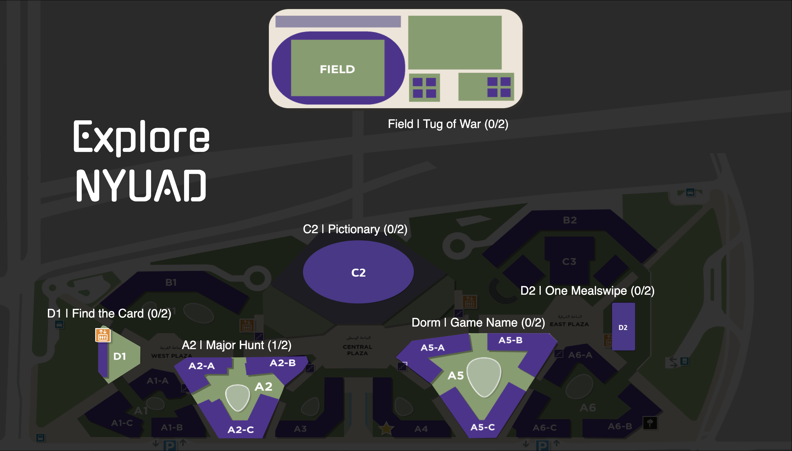


[Access Project Here](https://nyuad-expo-final.glitch.me)

[Project3 Documentation](#Project3)


### Project Brief 

This game is inspired by Expo 2020 where the visitors go around different pavilions to experience the unique culture of countries around the world. Similarly, in this game, players would explore the campus of NYUAD while visiting different places on campus. In each pavilion, the players would play fun 2-player game. 

Here are the six games: 

On the landing page, there would be a map of campus with 6 clickable locations, which will direct players to a game.  as well as the total number of players inside each game. The players can enter the game by clicking the button. At the Track & Field pavilion, players can play tug of war against each other. At the C2 admissions office, players can play a game where they need to collectively write down all majors on campus, and if they write the same major twice, they lose. The third pavilion is D2, where players are given an order and their goal is to complete as many orders as possible (the gameplay mechanism will be a click and pick). The last pavilion is a classroom in A2 where the players would play Pictionary. 

### Inspiration 


### Wire Frame
This is the initial wireframe I made focusing on the structure of the webpage and how users' would access each game. On landing page, users will be given the map of NYUAD with the locations highlighted to enter. When users click the location, they will be directed to the according game page. <br> <br>


<br> <br>

Using figma, I have designed the landing page. At first, I used the 3D modelling map of NYUAD. Here, I added location pin with the real-life images of the location in the shape of bubble. After discussing with Alia, we decided to use the 2D map of NYUAD with the part of the map highlighted. 

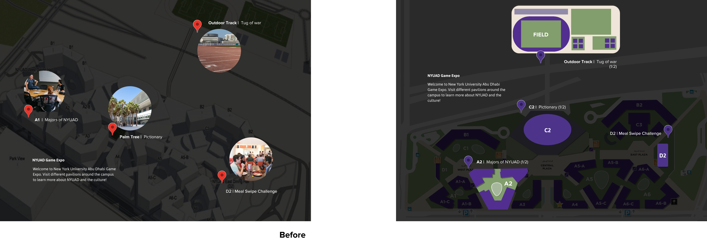 <br> <br>

We also designed the quick mockup of each game room to make sure the visual interface is consistent throughout the game. Although each game has its own unique features, by making the background consistent with image overlay and the title on the top, we made sure that the game feels - one big game with four minigames, rather than four separate games. 

<br> <br>


### Developing Game Mechanics 

The basic game mechanics of the two minigames are from our previous assignment - C2 | Pictionary from my [NYUAD Pictionary](https://bustling-tortoiseshell-citrine.glitch.me) and D2 | Tug or War from Alia's previous [Tug of War](https://tug-of-war-alia.glitch.me) game. Two other games were ideated in relation to the purpose of locations. For D2 (school cafeteria), inspired by burger making game, we decided to create a game where the players are given with order and need to click images of the D2 food to complete an order. For A2, we wanted to make a game where the players are asked to remember and type in the majors at NYUAD as quickly as possible. 

Following are the list of games available at NYUAD Expo:

1) A2 | Major Hunt
1) C2 | Pictionary
2) D2 | One MealsSwipe
3) Field | Tug of War
4) Dorm | 
5) D1 | Find the Card!


### Coding & Challenges

The most challenging part of this project was definitly the coding part. Some game mechanics had to be adjusted so that it is managable for us to code. For instance, instead of making the room open for everyone, we have set the limit of the players to be 2 players max. Alongside implementing the game itelf, we did many error checkings. I have learnt from this project that to create a game where the multiple players are playing realtime, there needs to be a lot of error checkings than a game for a single player. 


### Workflow


### Session Storage


Once the user joins the game, on landing page they are asked to enter their names. The entered name is saved in session storage. 

<b> landingPage.js </b> 
  
````
   joinForm.addEventListener('submit', (e) => {
      e.preventDefault();
      let name = document.getElementById('name-input').value;
      //save the name and the room in session storage
      sessionStorage.setItem('name', name);
    })
````
User connects to socket.io and is given with socket id. The user name, and the socke.id is paired at index.js file. <br><br>

### Map | Join Room


On map tab, users can click on the map to join the room. This function will redirect the user to (roomName).html The information about which room to join is also saved as session storage and emitted to the server.  <br><br>

<B> map | script.js</b> <br>

````
function joinRoom(img) {
    let room = img.id;
    //redirect the user to game.html
    console.log(room);
    if (room == 'Field') {
      window.location = '/field/field.html';
    }
    else if (room == 'A2'){
      window.location = '/a2/a2.html';
    }
    else if (room == 'C2'){
      window.location = '/c2/c2.html';
    }
    else if (room == 'D2'){
      window.location = '/d2/d2.html';
    }
    else{ //to be changed
      alert("not available")
    }
    sessionStorage.setItem('room', room); //save to session storage
}
````
  
<br>
  
Here, the user's name is paired with their socket.id and depending on the number of players in the room, following happens to the player<br>
1) The room is created (when 0 player is in the room), 
2) added to the room (when 1 player is in the room), 
3) or asked to wait (when more than 2 players are in the room). <br><br>

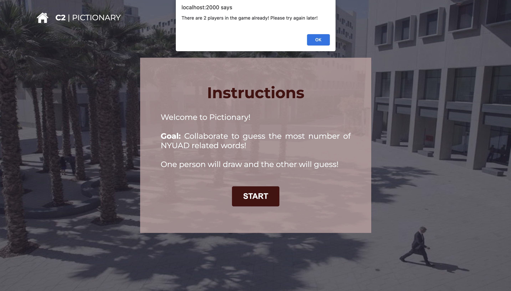
  
<b> Server | index.js</b> <br>

````
 socket.on('userData', (data) => {
        //save username in an array with their ID
        socket.name = data.name;
        users[socket.name] = socket.id;
        console.log(users);

        //let the socket join room of choice
        socket.roomName = data.room;

        socket.join(socket.roomName);
        if (rooms[socket.roomName]) { //if room exists
            // do not increment if there are 2 people in the room 
            if (rooms[socket.roomName] == 2) {
                console.log("Client > 2: ", socket.id);
                socket.emit('morePlayers', '');
            }
            else{
                rooms[socket.roomName]++;
            }
        } else {
            rooms[socket.roomName] = 1;
        }
  
````
  <br>
  
  
  ### Map | Display Number of Players in each Room
  
  
  
  <br>
Also when the client joins the room, the number of the players in each room are sent to the map to be displayed. For example, on the image above there is one player at C2. 
  
  <br><br>
  
  <b> Server | index.js</b> <br> 
  
  ````
  // get the number of players in each room and send to map
        let A2 = rooms["A2"];
        let C2 = rooms["C2"];
        let D2 = rooms["D2"];
        let Field = rooms["Field"];

        io.in("map").emit("A2PlayerNum", A2);
        io.in("map").emit("C2PlayerNum", C2);
        io.in("map").emit("D2PlayerNum", D2);
        io.in("map").emit("FieldPlayerNum", Field);
  
  ````
  
 ### Map | Error Checking - Unresolved
  
However, there is an error that is still unresolved. When the new client joins, the displayed number of players at each room is accurate. However, when the player returns to the map after joining the room, whether after completing the game or through clicking the home button, the number of client in each room is no longer accurate. The number of players in all the rooms are set to 0. This also means that when the user returns to the map page more than 2 players can join the same gameroom. We didn't know how to fix this issue. It is not only the display error but the number is not updated on the server side as well. 
 
Through more error checkings, I found out that when the user is fully disconnected by closing the tab, or joins another room on the map, it gets updated. Below shows how the three players can join the room after returnning to the map by cliking home button.
 
 
   

### GAME | 2 PAGES (Instruction + Play Game)

Originally, the instruction was going to be on the game page itself. However,due to the limited space, we added an instruction page where the players are prompted to read the instruction and click the **start** button before they enter the game. 

  <br><br>
 
Since the games are time-based, when there is only one player in the room, they shouldn't be able to start the game. It would be unfair when one player starts typing in the word while the other player is still reading the instruction. Therefore, we added the code where on window "load", it checks if there are two players in the game, and have read the instruction. If there is only one player even, when the player clicks **Start** the timer is not triggered nor the buttons or the input boxes are working.
 
   
  
By adding one more step: where the second player joins the room, and have clicked the **Start** Button, it sends **canStart** that allows all players to be able to access the buttons to begin the game, and the timer gets started as well. <br><br>

Although this sounds easy at first, in order to implement this was quite complicated. This is because the program has to first, track the number of the players in the room, then check if the player has finished reading the instruction, then wait for the player to click a button that starts the game (and the timer), send to all players to start running the game and timer in sync, as well as to start tracking their scores as soon as the game is started. 

<br><br>
 

### Play-Testing 

For the play testing, we had our basic game mechanics ready for testing. Our main aim for the playtesting was to check if the players are able to follow the instruction or visual cues without further help. We also wanted to see if there are any error checking that we have missed. 

**Here are some of the goals in mind:**

1) For D2 game, do they know how to delete the misplaced items with out the instructions? Is it intuitive to delete the item on the tray by clicking it again?


2) Are the instructions intuitive and easy to understand?


3) Do they want more/less time for each game?


4) Do they have fun when playing the game? (Are the games too difficult/easy to play?)


**Here are some of the things that I observed or feedback I got from the user testing:**

1) For A2 Major Hunt game, instead of randomizing colors for the bubbles, users want to see two different colors only: one color that represents themselves, and another that represents the counterpart player. This helps them to visualize how many majors they have guessed correct in comparison to the other person.

2) For the Field Tug of War game, increase the increment for each keypress. Users were struggling to win since the difference was only little. This will increase the game flow and the speed. 

3) One player mentioned that it would be nice if the game scores collected from each game can be summed up. 

4) They wish to see the **Home** buttons for each page. 

5) For the games that require players to "type-in", allow both capital letter and small letter 

6) Players hate reading. => Minimize text-based instruction 


Play-testing was fun and insightful. During the playtesting, I wanted to "observe" how users interact with the environment that we have designed for them to interact with. Therefore, I tried to minimize talking. Since the concept of the game is rather straightforward, to click a button to join a room, and start playing the games, I was surprised to see how people need only so much instruction to learn how to play the game. It was only 10 minutes short playtesting session but I was able to gain a lot of insights from their behaviors. 

### Reflection & Next Step

**Reflection**

From the ideation stage to design, and production, this project was a lot of fun. I loved how there was plentiful room for creativity and experiment. This gave me lots of freedom to make something original, and to create something meaningful using the skills I have acquired for the last 10 weeks. I am proud that I was able to code this with Alia as a team. Coding together means that we had to constantly and effectively communicate. We used github to work together. Before we push our files to github, we always made sure that we give each others a heads up and planned ahead to avoid working on the same file. 
<br><br>
To this regard, this project was convenient since it has many rooms with separate games. For each room, we made a sub folder. Therefore we dedicated to work on certain rooms and swapped the roles. However, since index.js file is shared across all four games, sometimes when we pushed together, the file got messed up. Learning from this mistake, we started to be much more careful when pushing the updated file to the github, or prevent the errors by sharing the code before uploading it. I find such skills I gained working as a team highly valuable.
<br><br> 

Overall, I am super proud of this game. Not only because I was able to create a web-based multi-player game for the first time, but especially because I was able to make a game that is unique for the community. One lessen I learnt is to manage file and organize code well from the beginning. It may take extra time at the moment to re-write the messy code or to restructure the game. However, this will save a lot of time in the future - for debugging, reorganizing, or making edits to the file. Especially since I was working with a partner, well-commenting what each line does was crucial for the other person to understand what changes were made. 


**Next Step**

The next steps for this game is clear: I want to improve on cleaning the visual elements of the game. Although we have spent a lot of time and effort on this project, 10 days were not enough. Some UI elements like buttons and how the text are displayed can be improved. <br><br>

I also want to learn how to manage socket.io better so that the number of clients in each room is updated everytime when they leave the room. As of now, I have found out that the issue is at emitting 'userLeft' to the server.

````
function joinRoom() {
   socket.emit('userLeft', '');
   console.log('left room okay');
   window.location = '/map/index.html';
}
````

Here, the comment 'left room okay' is logged and the player is located to mappage. However, socket.emit('userLeft', ''); is not passing through. Once this issue is solved, I want to make the accumulative score system where the player can collect the points from different mini-games and have them copmiled on the scoreboard that will be displayed on the map page. 

   
  
  
 
<a id="Project3"></a>


# Project 3

For project 3, we improved on the Project 2 by solving the unresolved socket.io Room issues and adding two more games that uses ml5 libraries.  

**Plans for Project 3**
````
 
 Before I start jumping into developing the project further, I have listed down things that I need to do
 
* Fix Room issue
* Add General helper functions (Spilt the file into the helper functions, an the main gameplay functions)
* Fix "addAnswer(this)" in the HTML to each of the images (do this in js with a loop)
* Revisit the gameplay mechanics (How many players in each room? Should Pictionary be competitive? collaborative? How does it affect Overall Scoring System?) 
* Add function to store the scores from the each game and add a scoring board per player
* Additional GAME1
* Additional GAME2
* A2 seperate Bubble Class into another javascript file
````

## Fixing Room Issue

This socket management issue took us many days to test and figure out how to solve. To check if the socket is connected properly and to manage the room, we used https://admin.socket.io/#/ to view the status, while the npm start is activated. 

Through this socket management, we found out that the issue where the user never join the map, and the information is not saved to session storage, when they click on the home button. 

So here, we also set the map as another room and save joining map room to the session storage.

````
//Session Storage

sessionStorage.setItem('room', "map"); //save to session storage
````

in index..js file, we also made sure we delete the user from they room if they click the home button and have them join to the room[map]

````
    //delete the user if they leave by clicking the home button
    socket.on('userLeft', () => {
        console.log("socket has been disconnected ", socket.id);
        if (rooms[socket.roomName]) {
            rooms[socket.roomName]--;
        }
        delete users[socket.name];
        console.log("The users left in: ", socket.roomName, users);

        socket.leave(socket.roomName);
        socket.roomName = "map";
        rooms["map"]++;
    })
    
 ````

## Add Helper Function

Mini-games share many lines of code including - connecting to socket.io, counting time, displaying (instruction | gameplay | endgame pages), and more. Instead of repeating the same structure of code for each game, we added helper function to manage multiple games at once. 

This is how the files are currently structured:

   
  
Under this structure, if there is one line of code that needs to be changed, for example, to block the display of the div rules, all four javasciprt files need to be changed. 
  
  <br><br>

This is how the files are structured with the Helper function:

  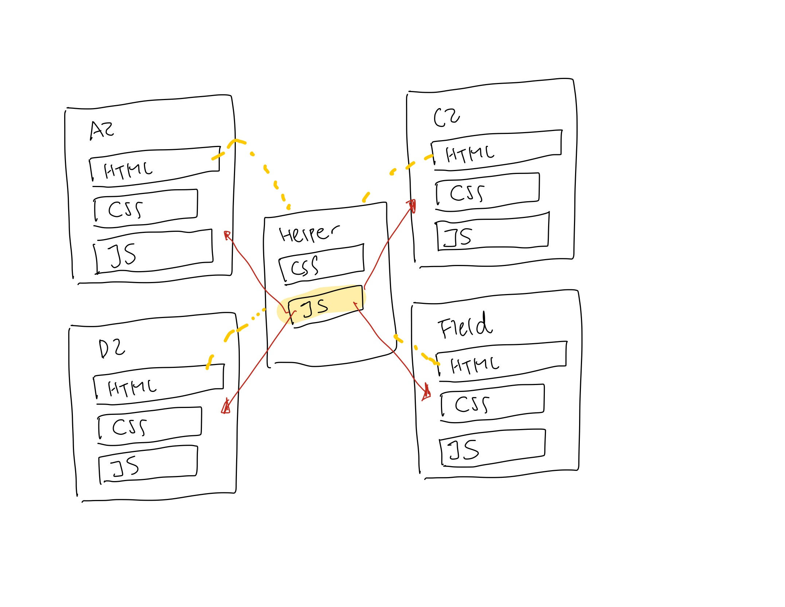 

With the Helper function, all the games can be managed by one specific file. <Br><br>

Since we didn't start with the helper function, we had to back-track the individual files to edit and add the helper funciton. The issue was that Alia and I have structured the code and the room management slightly differently. Therefore, making a general Helper function could not be applied for all the games. Each element had to be compared and modified to build a helper function, which required us to restructure and recode the entire game. Lesson was learnt, so instead of adding helper function for the existing games, we decided to add a helper function for the two new games we are adding.

**Lesson**

When building a complex project like this with mini components, always plan ahead and add helper function. This will save a lot of time in the future to manage and iterate the project.


## Extra Games
  
For week 11, and 12, we have experimented with different client-side libraries including: D3, ML5, Three, and WebRTC. We brainstormed a few games that we could add incorporating these libraries. 

  - Charades with real-time video (p5LiveMedia Simple WebRTC)
  - Find objects from the room (ML5 machine learning image classification)
  - Physical-Digital Card Game (ML5 machine learning image classification)


## Charades
  
 When building Charades game using p5 livemedia, I ran into an issue where p5livemedia opens its own socket and overrides the existing socket system, and disabling them. 
  
  
  ````
  
  <script type="text/javascript" src="https://p5livemedia.itp.io/socket.io.js"></script>
  
  ````
  
A collegue of mine also faced this issue for another project. He was able to solve this issue by using p5 live media to send data, instead of using sockets to send data. However, for my project, I send multiple types of data to manage rooms, track scoring systems, track number of users in each room, and more. Therefore, adopting this solution wasn't ideal. <br><br>
  
 Another proposed solutions were:
  
  - using lower level webrtc library - peer JS or simplePeer JS
  
  - Forcing multiple sockets from one page
  
  
There were multiples solutions to be explored. For now, I decided to work on the physical-digital card game! 


## D1 | Find the Card [Physical-digital Card Game]
  
The idea of this game originated from one of my favorite cardgame **Ghostblitz** where the players pick the card with clues and grab the item that matches the answer from the clue. Whoever snatches the correct item quickest win the game. 
  
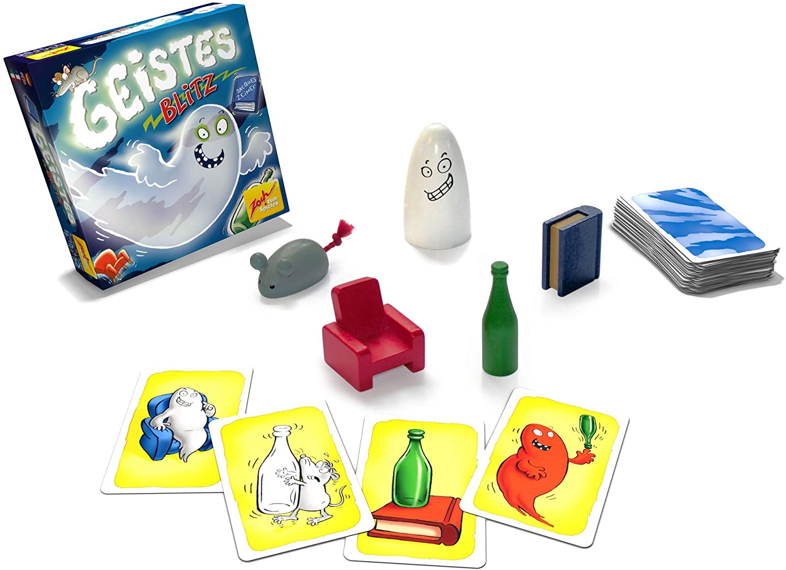 
    
 I decided to make a digital version of this game. To customize the game unique to this theme of the game NYUAD, I created cards with five items: 1. Palm Tree 2. Mosque 3. Cactus 4. Sun 5. Dune <br>
  
  This is a physical card-deck, which players can print and use:
  
 
  
  This is a digital card-deck, which will be used for the players to receive the clue. 
  
   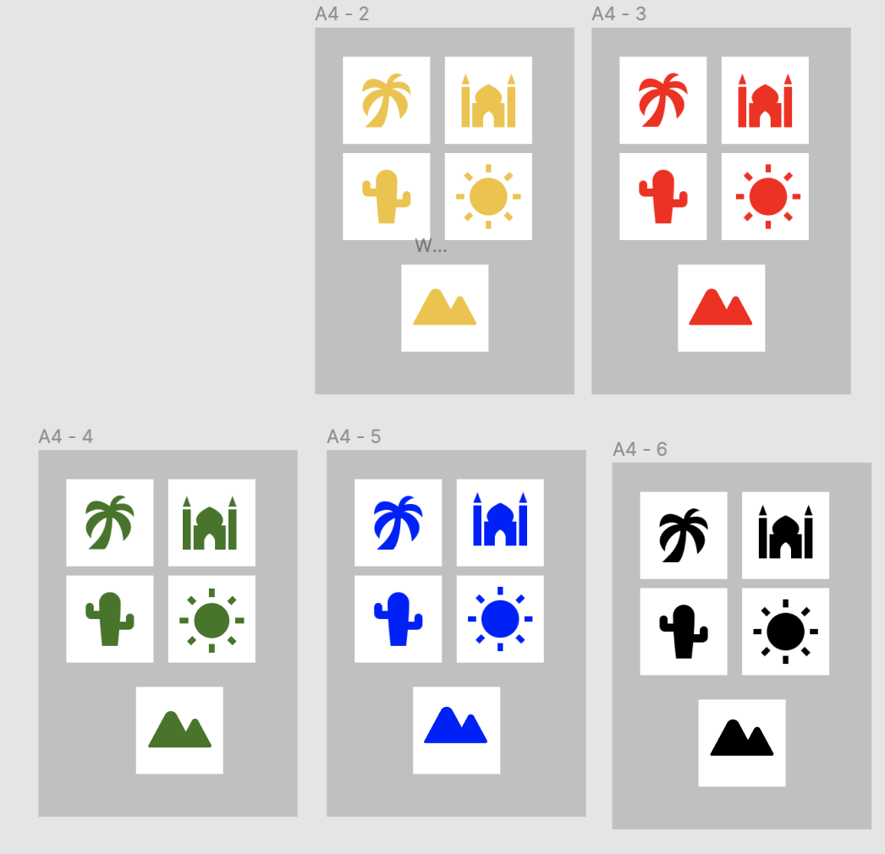 
  

 ### Gameplay Mechanics
  
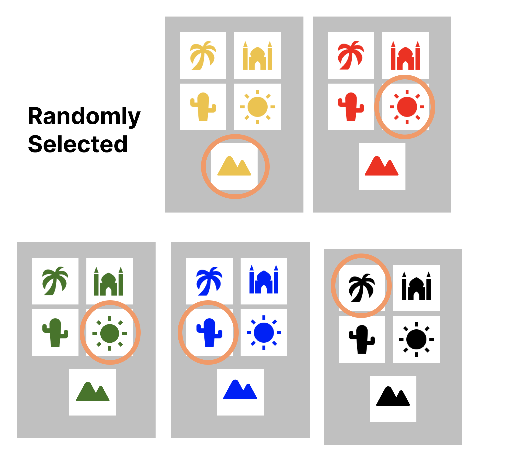 
  
- The game mechanic is that players will pick a card with a set of clue. Each card will have five items - one from each color set. An item from each color category is randomly selected. (Simply put, it's like throwing 6 different dices)


- Five randomly selected cards are the clues. Player need to read the clue and identify the answer. 

  
   
  
  
  
There are three possible scenarios:
  
1. All objects appearing on cards are different. Identify the color in which the sun appears in (Green). Then, pick up the card of the same color from your deck (cactus). 
2. If you have two pairs of the same objects appearing on the cards, identify the object that is singular(mosque). Then, identify the color associated with that object (blue). Then, pick up the card of the same color from your deck(sun). 
3. Two (or more) objects of the same type appears on the cards. Identify the object that appears the most (dune), then identify the color associated with this object from your deck(yellow). Then, pick up the object associated with this color from your deck(sun).
  


## Implementing Throwing Dice Mechanics: Pick cards (clues) Randomly 
  
 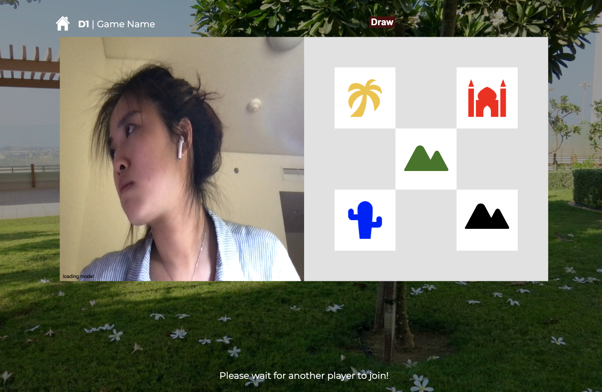 
  
To simulate this random picking card (throwing dice mechanic) I originally coded in a way that it picks 5 random cards everytime when the button is pressed. I have set an array for each color of cards. Each array has 5 different shape images assigned with the numbers between 1-5, and when the button is pressed, it picks the random number, and the shape of that number is displayed. This part was coded successfully. 

However, to develop a code that chcecks the correct answer was rather complicated. As a solution, I decided to create a random set of clues in advance, and bring these set randomly as such: 
  
    
  
  
 Preload image
  
  ````
  function preload(){
  for (let i = 1; i < 6; i++) {
    cards[i] = loadImage("images/"+ i + ".png");
  }
}
                      
  ````
                        
Randomly select the clue option 

                        
````
  if(allow_start == true) {
    socket.emit('d1Start', ''); //start game for the rest of the users
  index = int(random(1,5));
  //dice throw
  image(cards[index], windowWidth*0.425, windowWidth*0.025, windowWidth*0.35, windowWidth * 0.35);
  socket.emit('index',index);
}                  
                     
````                        
  
This way, I can predetermine the answer and simply assign the image to the correct value.
  
  
````
                       
socket.on('indexFromServer', (index) => {
  pick.style.opacity = "0";
  pick.disabled = true;
  rectangle.style.opacity = "0";

  if (index == 1){
    console.log("new deck palm");
    thiscard = "palm"

  } else if(index == 2){
    console.log("new deck sun");
    thiscard = "mosque"
  } else if(index == 3){
    console.log("new deck mosque");
    thiscard = "palm"
  } else if(index == 4){
    console.log("new deck mosque");
    thiscard = "mosque"
  } else if(index == 5){
    console.log("new deck dune");
    thiscard = "dune"
  } else if(index == 6){
    console.log("new deck dune");
    thiscard = "palm"
  } 
})
  
````                        

 ## ML5 machine learning image classification
  
  I have adapted Daniel Shiffman's Machine Learning with ml5.js example to train card images using p5.js
  
  [Train cards p5.js](https://editor.p5js.org/Soojin_lee/sketches/ZFcmHK5Tv)
  
 
   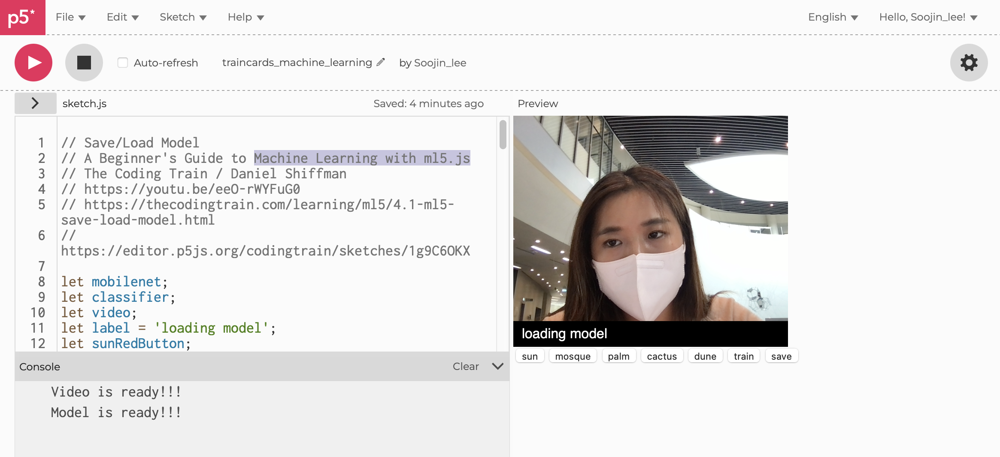 
  
  
  ### Number of classifiers to train data
  
  ** Default **
  
  ````
    classifier = mobilenet.classification(video, videoReady);
  ````

  
By default, it only trains 2 different classifiers. By adding { numLabels: 6 } I was able to set numLabels to the number of classifiers I want to train the data for. 
  
  
  ````
  classifier = mobilenet.classification(video, { numLabels: 6 }, videoReady); 
  ````
  
  Although this seems to be a simple solution, without knowing why, I was really confused why some classifiers are not being trained, nor the solution to this problem. 

## Machine Learning | Training data
  
   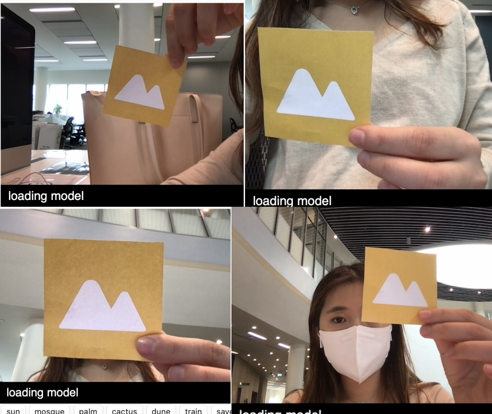 

When trainning the card images, I hold the cards near to the camera, far away from the camera, and at different backgrounds to increase the accuracy and variables. In this way, later when classifying the results, I can set the confidence higher to make sure it only detects when the player shows the "correct" card, not when the background. 
  
````
  
function gotResults(error, result) {

  classifier.classify(gotResults);
  if(result[0].confidence > 0.98) {
    label = result[0].label;
    console.log[label];
    thislabel = label;
    checkMatch();

  } 
}


````

The accuracy is set to 0.99


### Locating model.weight.bin File
 
 After training the data, I download the model.json file and model.weight.bin file to apply to the current project. When the two files were added, I faced the error: 
    
 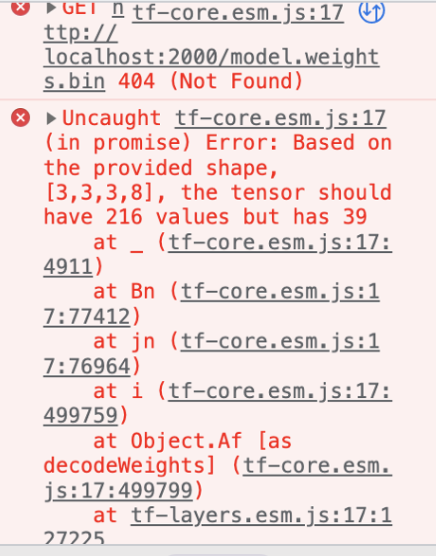 
  
I struggled with finding out know why this error was appearing. I identified that the issue was at finding the location of the .weight.bin file. Originally, the model.weight.bin file is called from model.json file as such:
  
   ````
  
   "paths": [
                "./model.weights.bin"
            ],
  ```` 
  
  
 After changing the file directory to the d1 folder, the issue was solved
  
  ````
  
   "paths": [
                "./d1/model.weights.bin"
            ],
  ````

### Detecting Correct Answer 
  
  Once the json file was uploaded properly, I could test if the camera detects the correct answer. For example, for this specific clue, the answer is a palm tree card. 
  
    
  
When the correct card is shown to the camera, it identifies the classification and if the image classification is palm, and the confidence is higher than 0.98 it emits the "correct" signal to the server. The player who got it correct first will have added score, and the pick button is enabled to start the new round. 
  
  1. If the video detects the image with a confidence higher than 0.98, it starts the function checkMatch()
  
  ````
  
function gotResults(error, result) {

  classifier.classify(gotResults);
  if(result[0].confidence > 0.98) {
    label = result[0].label;
    console.log[label];
    thislabel = label;
    checkMatch();

  } 
}

  ````
  
  2. If the detected classifier (thislabel) is equal to the answer (thiscard), then emit 'correct' to server
  
  ````
  
  
  function checkMatch(){
  if (thislabel == thiscard){
    console.log('match');
    thiscard = 'none';
    console.log('match2');
    socket.emit('correct', '');
    pick.style.opacity = "1";
    pick.disabled = false; 
    rectangle.style.opacity = "1";
  }
}

````
  3. Alert correct to all players
  
````

// permission to start the game
socket.on('correctFromServer', () => {
  console.log('correctforeveryone');
  inst.textContent = "Correct!";

})
````
   3. Add score and update
  
  ````

   // permission to start the game
   socket.on('scoreadd', () => {
    console.log('addscore');
    myScore++;
    score.innerHTML = 'My score:' + myScore + '| Their score:' + theirScore;
  }
  
   // permission to start the game
   socket.on('theirscoreadd', () => {
    console.log('theirscoreadd');
    theirScore++;
    score.innerHTML = 'My score:' + myScore + '| Their score:' + theirScore;
  })
  
  ````
  
  

## One player in the room 
    
    
  
  If only one player is in the room, the pick card button is disabled and the player is notified to wait for another player to join. 
  
 
  
 
## Playtesting
  
    
   
  
  
Once the game was developed. we conducted a playtesting to check if the players understand the instruction and the game mechanic that is rather complicated. The main goal of this playtesting was to find out if the players understand how to play the game with the given instruction. 
  
 
    
  1. Players find the game too difficult (especially with three different scenarios)
  
  Since the game was too complicated compared to the rest of the game, players find it a bit overwhelming to follow the instruction. One recommendation was to simplify the game by allowing only one scenario. The game will be still fun since they need to compete who finds the correct answer first. 
  
  
  2. Players don't remember the instruction
      
Some players start the game without reading the instruction carefully. Once the game is started, players can't read the instruction again.  Some players remembered how to play the game but some players didn't. Therefore, I decided to add instruction pop up box.

  
  3. Download and... What? 
  
I was suggested to make the cue sign for downloading and printing out the card deck more obvious. Instead of the button "download" name it "download and print". This is a more intuitive instruction. Originally I used different color for download button (a tone down than start button). The player thought the button was disabled. 


## Simplify Game 

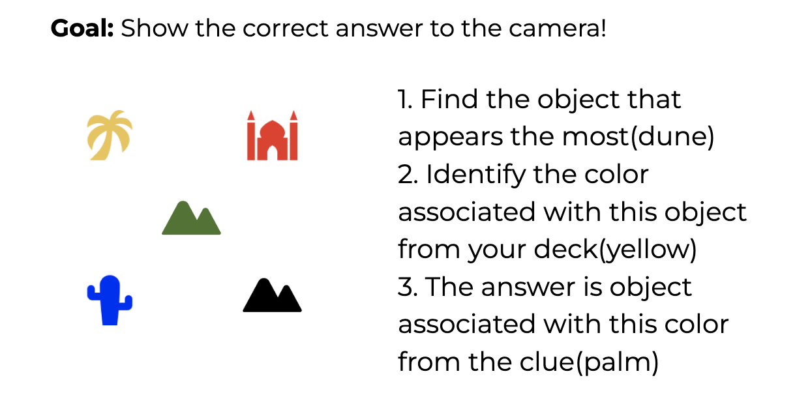 
  
  Instead of giving possibilities of three scenarios, I only added clues that has two same cards and three different cards. This way, the instruction became much simplier. 
  
## Pop-up Instruction 
  
  I added a feature where player can revise the instruction by hover on __ while playing the game.  

 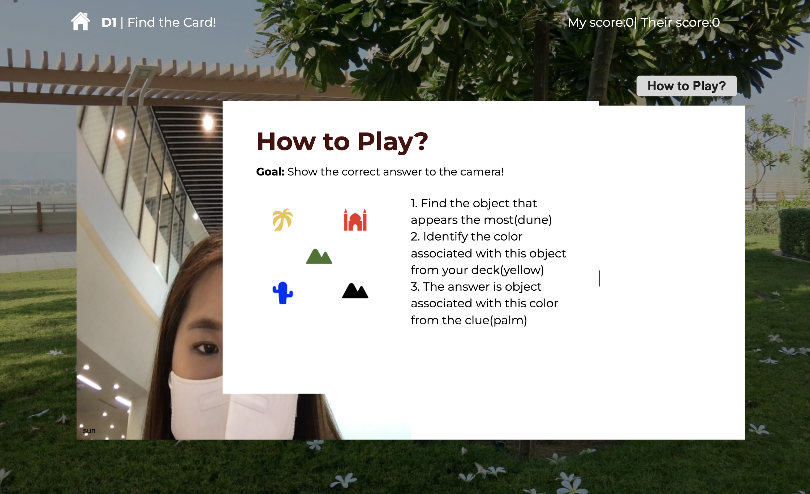 
  
## Add download PDF 
  
    
For the players who are playing at home, they can downlad the card deck by themselves and enjoy the game. 
  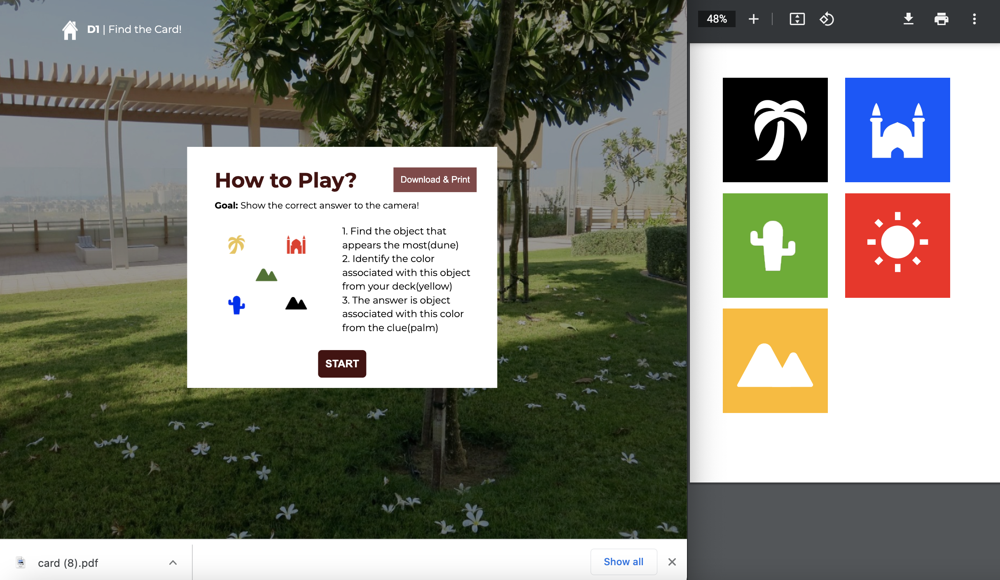 
  
  
## Fix Pictionary Gameplay
  
  I received a feedback that for pictionary game, two players are often confused with how to play the game. Who is draing? and who is guessing? To make the game more intuitive to play, I added instruction texts that specifically tells the two players what to do. 
  
  When the first player joins, 
  
    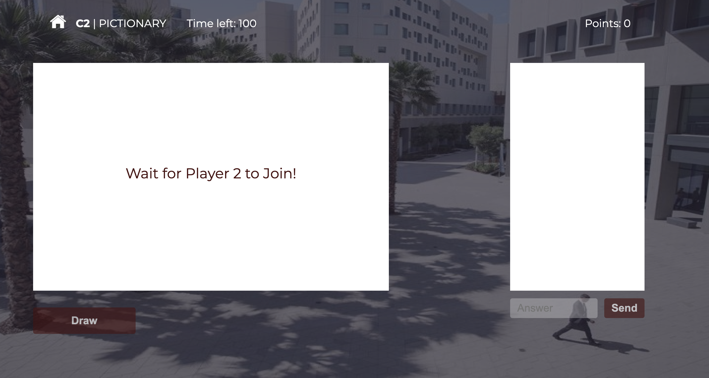 
  
  
  
    When the 2nd player joins, 
  
     
  
  
  
  
    If you click Drawing, it instructs you to draw, and disable guessing word input section
  
    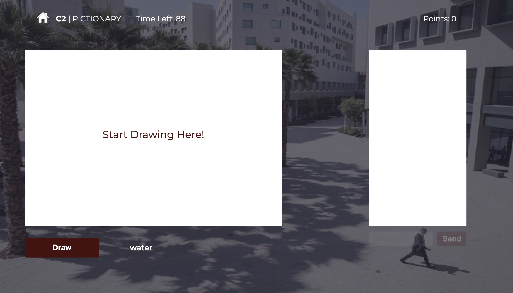 
  
  
    
    If the other player clicked drawing, you are instructed to Guesss and drawing function is disabled:
  
    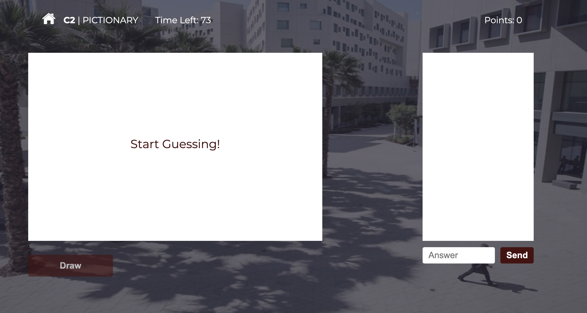 
  
  
  
      
    If the player guess correct, it notifies all players "Coorect", and instruct to click draw button again:
  
     


  

