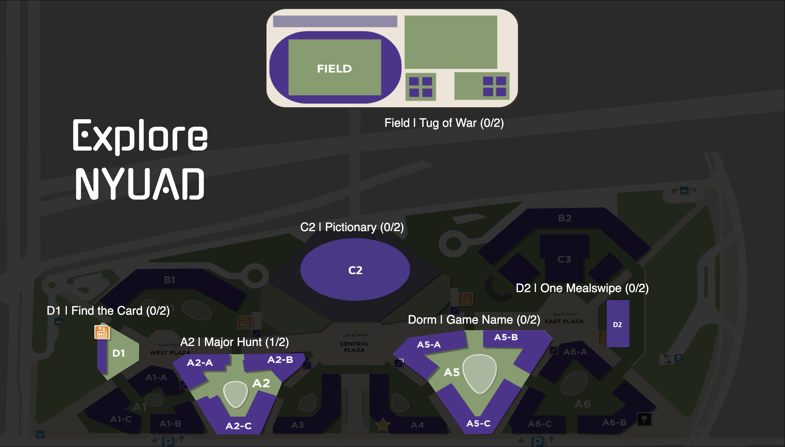
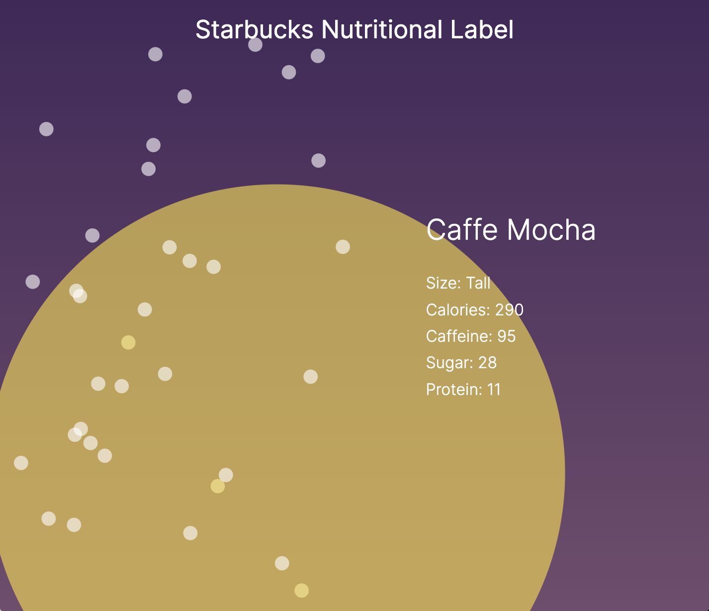
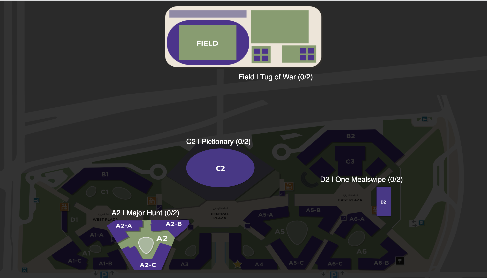
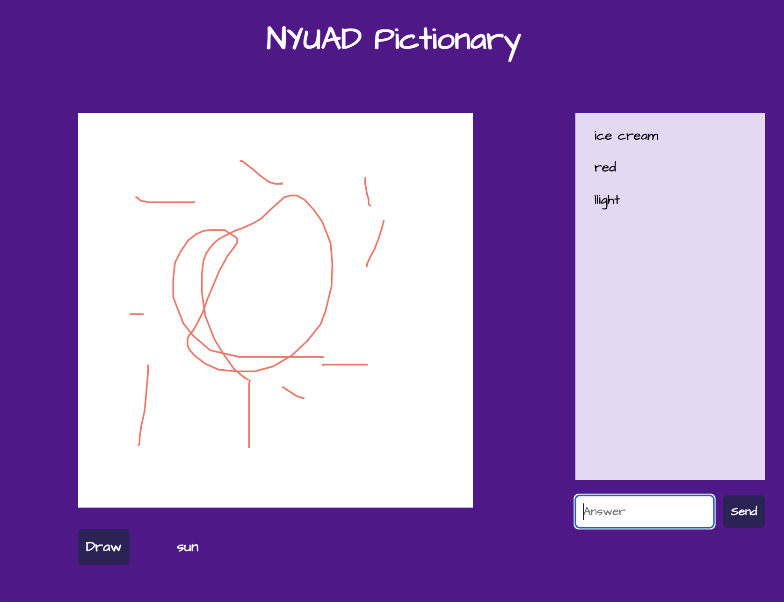
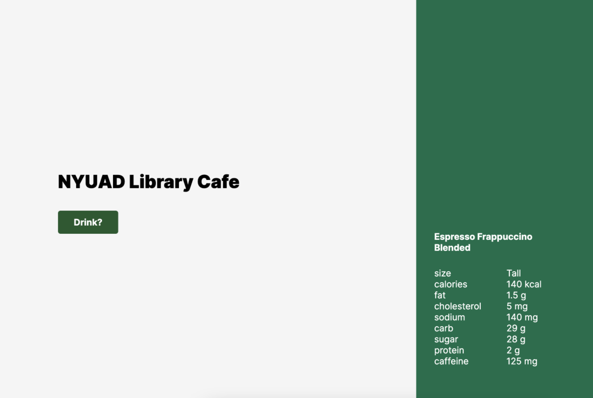
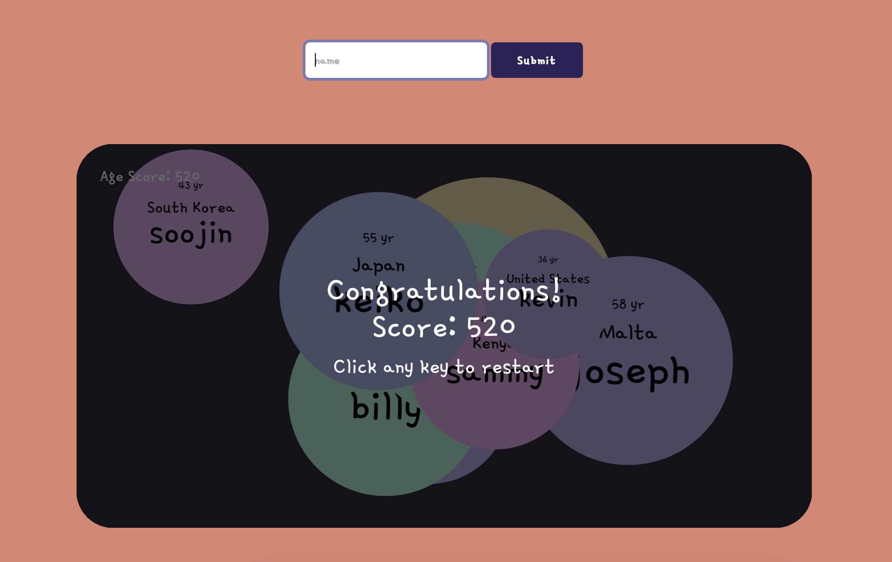
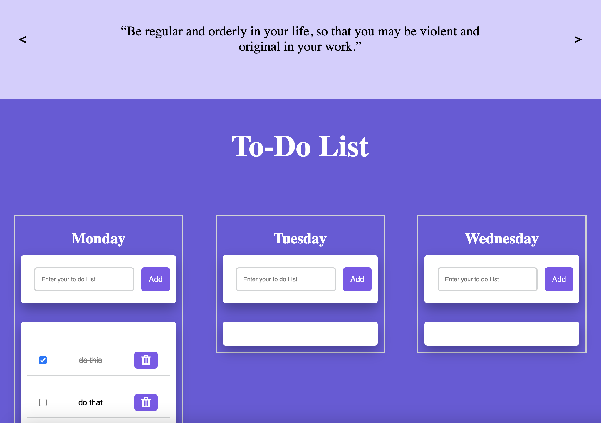
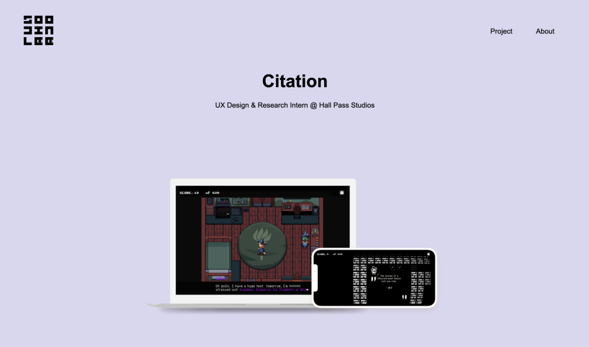

# connectionsLab

Welcome to Soojin's ConnectionLab Project Portfolio. In Fall 2022, I designed and developed diverse connected web applications from data visualizations to multi-player games. Working with both the cleint-side and the serverside, I learned how to build a project end-t-end, learned how to manage and work with data, gained comfort working with Javascript languages and the ecosystem of open source Javascript libraries, and leveraging real-time communication through purposeful design. 

# Final Project | Client & Server-side Web Application

[Play NYUAD Expo](https://explore-nyuad.glitch.me) | Node.js, Socket.IO, Express.js Connected Game 

[NYUAD EXPO Documentation](https://github.com/Soojin-Lee0819/connectionsLab/tree/main/Project2)

 
 
# Week 11 | Client-Side Libraries

[Starbucks Nutritional Label Documentation](https://github.com/Soojin-Lee0819/connectionsLab/tree/main/Week11) | Data Visualization Using D3 Library 

Starbucks Nutritional Label Data Visualization using D3

 

# Project 2 | Application that sends and receives data!

[Play NYUAD Expo](https://explore-nyuad.glitch.me) | Node.js, Socket.IO Connected Game

[NYUAD EXPO Documentation](https://github.com/Soojin-Lee0819/connectionsLab/tree/main/Project2)

Multiplayer creative game arcade featuring NYUAD themed pictionary, Guessing major, Making Meals, and online tug of war.

 

## Week 8 | Introduction to Sockets

[NYUAD Pictionary Documentation](https://github.com/Soojin-Lee0819/connectionsLab/tree/main/week8_NYUAD_Pictionary)

[Play NYUAD Pictionary Here](https://bustling-tortoiseshell-citrine.glitch.me)

NYUAD themed pictionary game

 

## Week 6 | Node.js and Express

[Starbucks Nutritional Label Node.js](https://github.com/Soojin-Lee0819/connectionsLab/tree/main/week6_Starbucks_node_express)

Building Starbucks nutritional label API and reimagining NYUAD Library cafe menu website

  

## Project 1 | Data Visualization Game

[Names Around The World Documentation](https://github.com/Soojin-Lee0819/connectionsLab/tree/main/Project1) | Data Visualization, API, Game

[Names Around the World](https://soojin-lee0819.github.io/connectionsLab/Project1)

 

## Week 2 | JS Interaction

[Weekly To-Do List Documentation](https://github.com/Soojin-Lee0819/connectionsLab/tree/main/Week2)

[Weekly To-Do List](https://soojin-lee0819.github.io/connectionsLab/Week2/)

To-do list page with a motivational quote slideshow

 

## Week 1 | Intro to HTML CSS

[Application Critique](https://github.com/Soojin-Lee0819/connectionsLab/blob/main/Week1/Application-Review.md)

### Assignment: Citation Portfolio

[Project Documentation](https://github.com/Soojin-Lee0819/Connections-Lab-Week-1-Portfolio-Page)

[Citation Portfolio Page](https://soojin-lee0819.github.io/Connections-Lab-Week-1-Portfolio-Page/)

Static webpage documenting Citation, a game production project

