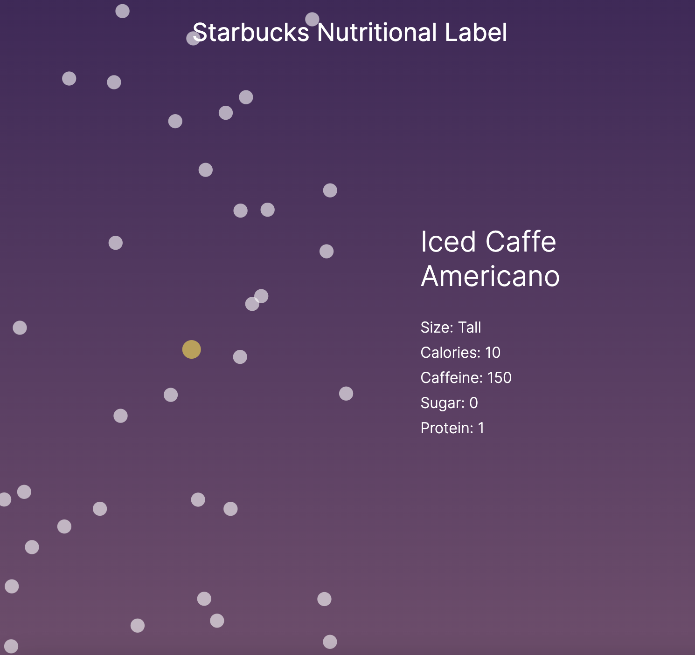
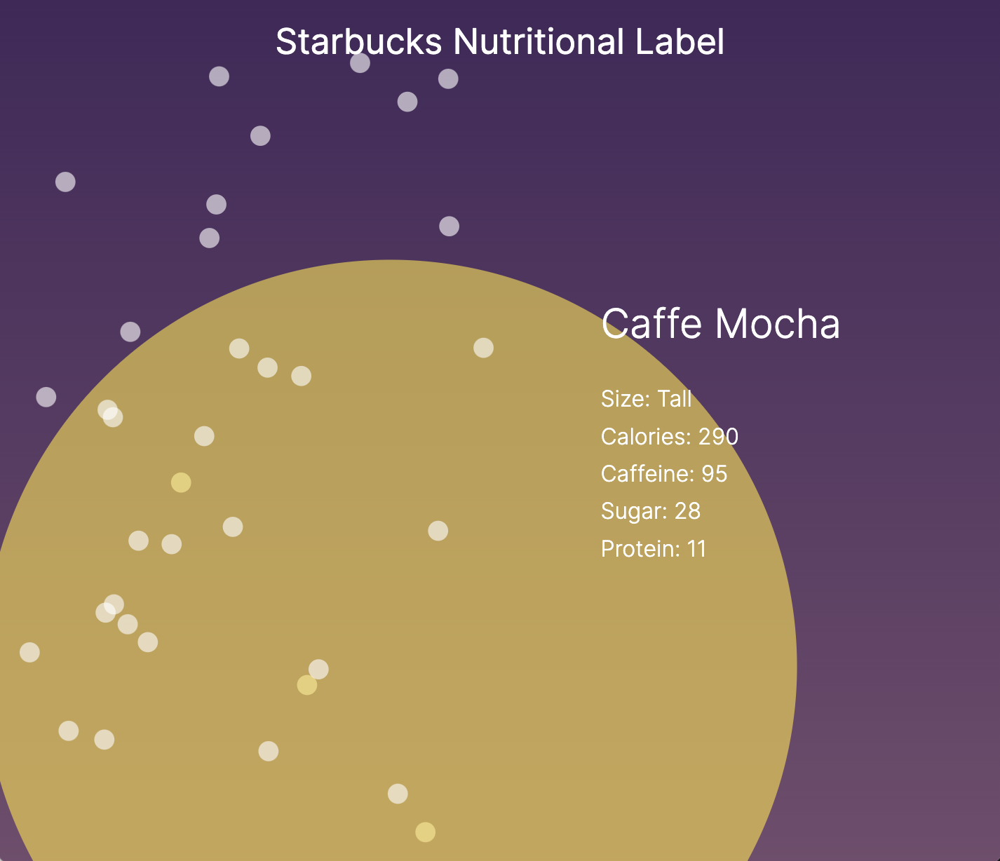

# Starbucks Nutritional Label

**Title**:Starbucks Nutritional Label <br>
**Category**: Assignment Week 11 <br>
**Date**: 13 April 2022 -17 April 2022 <br>
**Group**: Soojin Lee <br>
**Deliverable**: CSS/HTML/Javascript/D3 Data Visualization <br>

[Access Project Here](https://soojin-lee0819.github.io/connectionsLab/Week12/index.html)

## Overview
For this week, I had to use one of the library;D3, Three.js, Ml5, Aframe, Tone.js, Rivescript, Leaflet. I created a project that visualizes Starbucks nutritional label using D3 library. Users can hover on the dots (each represents a menu available at NYUAD Library Cafe). On hover, users can view the nutritional values of the selected beverages, and according to the kcal of the beverage, the transition animation is determined. Check out the project to experience the immersive visualization of the nutritional value of your favorite drink at the library cafe!

## Responsive Design
I have spent a lot of time making SVG screen responsive. To set the width and height responsive to the screen, I had to declare width and height as such:

````
let width = window.innerWidth;
let height = self.innerHeight;
````

then appended them as a class, and give viewBox attribution. 

````
    //Create an SVG
    let svg = d3.select('#container')
        .classed("svg-container", true)
        .append("svg")
        .attr("viewBox", [0, 0, width, height])
````

## Accessing Data

Understanding the structure of the json data was key for this exercise. Since my data file is quite complicated - It is an array of objects. To access the specific data that I have in mind was not easy. For example, to make an array of coffee List, where each coffee contains detailed information, I had to create an array and push the objects into the array. 

````

let coffeeList = [];

//Fetch Coffee Data
fetch('coffee.json')
    .then(response => response.json())
    .then(data => {
        //do something

        for (let i = 0; i < data.coffee.length; i++) {
            let coffee = data.coffee[i];
            coffeeList.push(coffee);
        }
        addSVG(coffeeList);
        console.log(coffeeList);
    })

````

## Final Outcome

This is the final result of the project. Below is when the user hover on the beverage "Americano"



Below is the beverage cafe Mocha. The circle animation is much bigger in comparison to Americano. 




## Reflection
For this exercise, I originally wanted to create a bar chart that shows the nutritional level for each item. However, creating a bar chart on dot hover was much more complicated than what I initially thought. Therefore, instead, I decided to display values as text in innerHTML, and add properties to the circle itself according to the value of the data. I am happy with the final outcome. Not only to access the information but just simply toggling between the dots to see the data-driven animation was satisfying and pleasurable. However, I would like to continue exploring the library to its full potential. 

