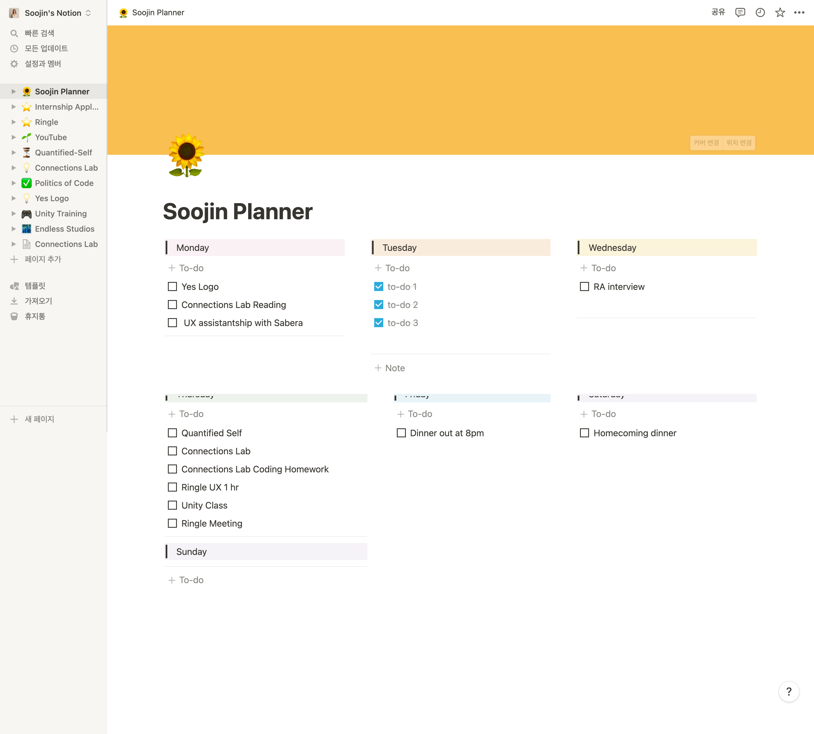
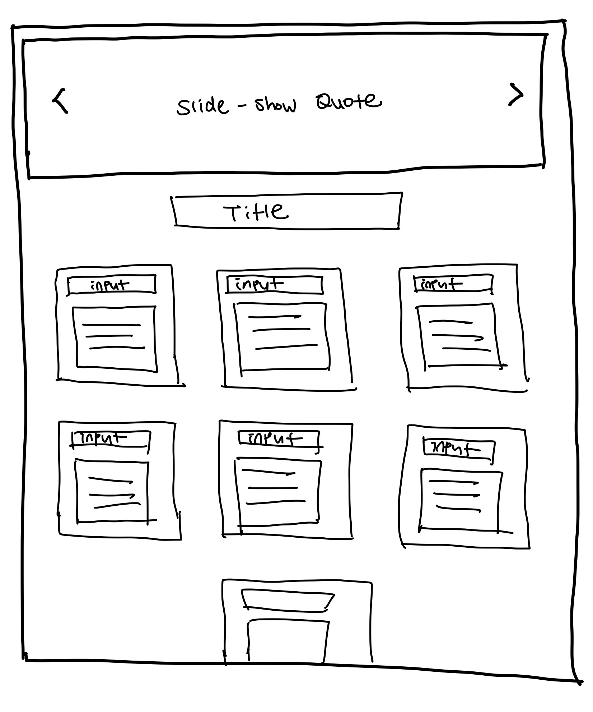

# Weekly To-do List

**Title**: Weekly To-do List  
**Date**: 5 Feb 2022  
**Deliverable**: CSS/HTML/Javascript Webpage  

[Access Project Here](https://soojin-lee0819.github.io/connectionsLab/Week2)

### Overview

For week 2, I learned how to make interactions using Javascript. Inspired by my Notion planner that I use everyday to stay productive, I created an interactive To-do List page for this week's assignment. I wanted to create a weekly To-do-list page, similar to the notion page I am using, with a motivational quote slideshow on top. This project has two main user-interactivities; Motivational quote slideshow click, and to-do list user-input interactivity that was more complex to build. 

### Wireframe

### Process & Challenges

1)I started with creating motivational 

To prevent an error, I added a function where if user adds 

3) Along with click 

### Project Image

### Reflections 

Although it is simple and uncomplicated for the user, to develop the system, there were a lot more thought put into the process. For example, 
