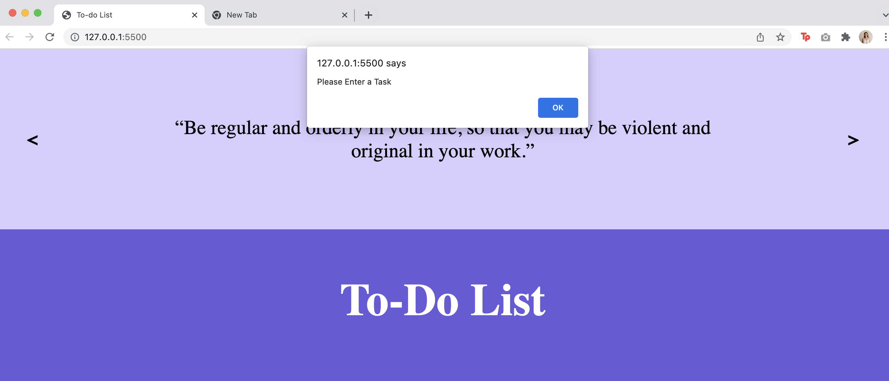
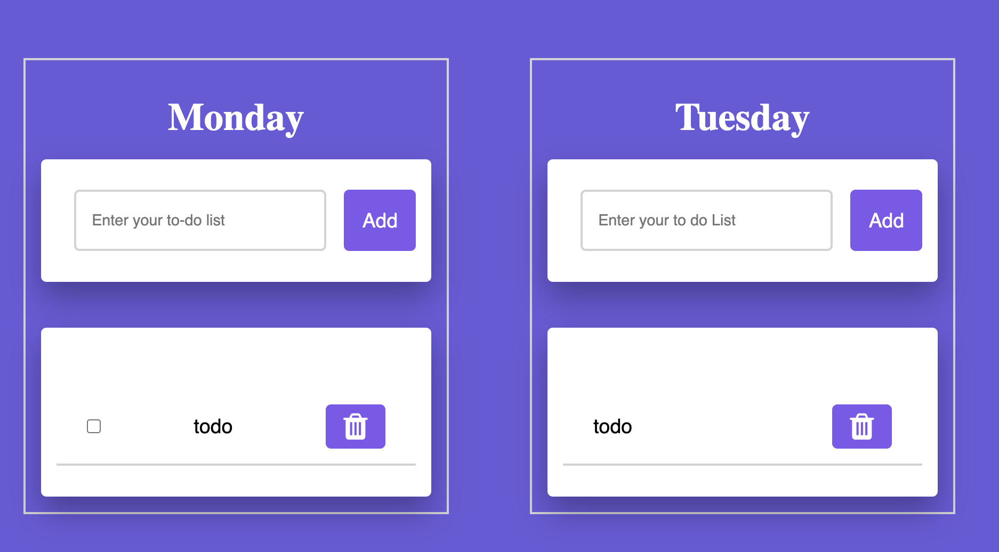
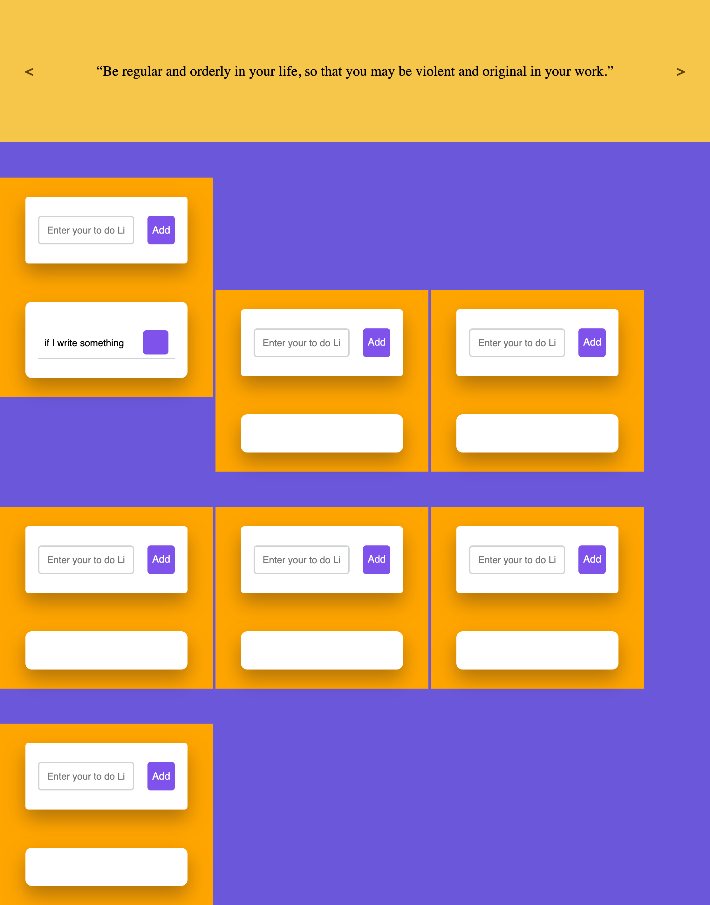
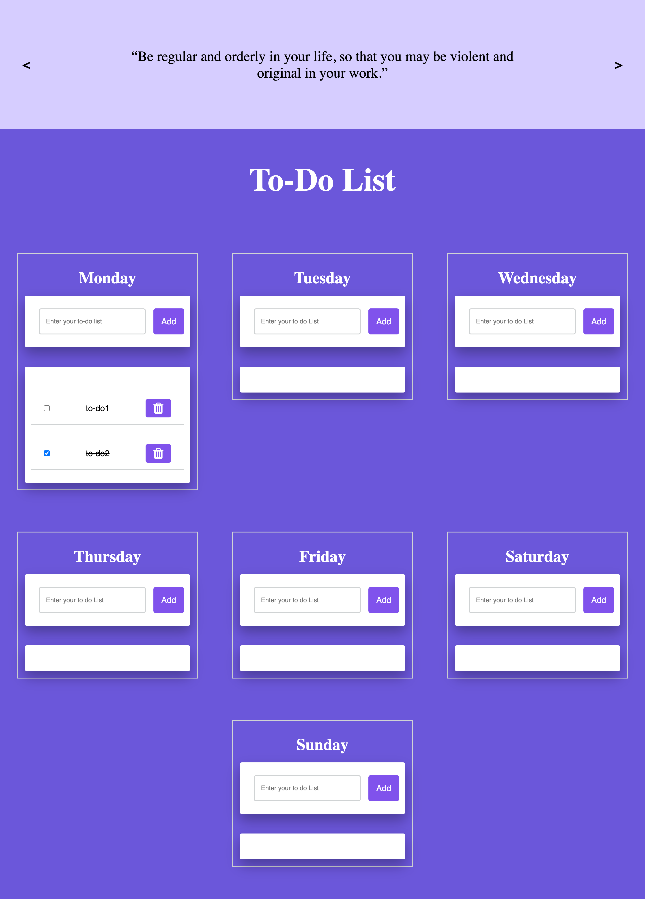

# Weekly To-do List

**Title**: Weekly To-do List  
**Date**: 3 Feb - 6 Feb 2022  
**Deliverable**: CSS/HTML/Javascript Webpage  

[Access Project Here](https://soojin-lee0819.github.io/connectionsLab/Week2)

## Overview

For week 2, I learned how to make interactions using Javascript. Inspired by my Notion planner that I use everyday to stay productive, I created an interactive To-do List page for this week's assignment. I wanted to create a weekly To-do-list page that has a motivational quote slideshow on top. This project has two main user-interactivities; motivational quote slideshow that moves on click, and to-do list user-input interactivity that has user-input, add/delete button and checkbox functions.

## Wireframe

Section 1 - Motivational quote slideshow with prev & next button

Section 2 - Weekly To-Do list (from Mon- Sun). Inside each container, there is a user input section, and an output section where the inputted tasks appear.

## Process & Challenges

**Workflow**

**Quote Slideshow**  
1. Create slides for the quote  
2. Add Prev/Next button for the slideshow  

**To-do List**  
1. Validate Input field for To-do list
2. Add a new task function 
3. At empty input, pop-up error message
4. Deleting a task 
5. Crossing out a completed task
6. Clearing input field after each entry
7. Error message pop-up(if the add button is pressed when the input field is empty, show error message) 
8. Add focus() method for input element ready for entering
9. Duplicate To-Do list for 7 days
10. Allow press Enter to add new task

### Motivational Quote Slideshow 
I started with creating a motivational Quote slideshow. I found out that there is a <q></q> tag for quote. It wasn't too complicated but after learning how to use API, I want to replace this section with quote API to have a more varieties of quotes and to add an element of surprise. 

 ### To-do list system
 
 Before start coding, I listed the steps for how users would add to-do list; from users clicking on user-input section -> type-in task -> click add -> task is added to the to do list -> when the task is completed, users can mark complete -> if needed, users can delete the task 
 

### Error prevention
To prevent an error, I added an alert system where if the input section is empty(input value.length == 0), it gives a feedback for the users to enter a task.

### Adding Checkbox
Initially, to mark completed tasks, I created a class "completed" and added an eventlistener to strike the line when the text is clicked. However, without a checkbox icon, the process of clicking the completed task to mark it complete wasn't very intuitive. Therefore, I added a checkbox, that visually signals users to clcik on it when the task is completed.

### Grid system 
Developing a grid system for 7 days of to-do list was challenging. When the task was added, the neighboring list on the same row were pushed down. To fix the issue, I used in-line block display with relative position to make sure the input bar is always stick to the top of the row. To see the position and orientation better, when coding, I added background colors to each to-do containers. 

### Final Project Demonstration

## Reflection & Evaluation

One takeaway from this exercise is that seemingly simple user-interaction can take many steps and considerations to develop the interaction. For example, for users, to use the to-do list function, they just need to type in task and press add. However, from the developer's perspective, I need to consider how the input tasks are stacked to one another, how to prevent errors of user adding an empty task, and much more. I have edited/added more features along the way - such as check-box system that allows users to click to mark completed task. 

For the following projects, I want to learn how to write more effecient code. I also want to add the function where users can drag and move tasks from one list to another.One concern with this web-based weekly to-do list is that without a log-in system, when tab is closed, the input data is lost. Therefore there should be a log-in feature where the input data can be stored with user ID and the stored data is displayed at log-in. 
