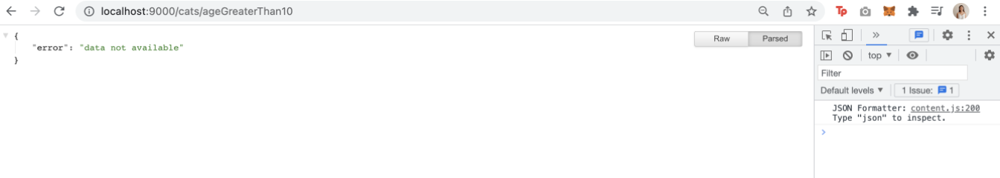

# NYUAD Library Cafe Nutritional Label 

**Title**:NYUAD Library Cafe Nutritional Label  <br>
**Date**: 3 Mar - 6 Mar 2022 <br>
**Deliverable**: Node-Express app using CSS/HTML/Javascript.node.js  <br>


## Overview


For this week, I created own API that serves JSON file, and made a webpage that fetches the API I created. For this specific project, I wanted to create something that is useful for the community members of NYUAD. On campus, there is a Starbucks library cafe. While the menu displays the price, there is no further information about the nutrientional information. Therefore, I decided to create an API that has the nutritional label for each drink item in the library cafe and make a website that uses this API.

## Creating API Server

The nutritional information for starbucks drinks were found here [Starbucks Nutrition Analysis](https://github.com/yhejazi/starbucks-nutrition/blob/master/data/sbux_nutrition.csv).

This data set includes following nutritional information:
- Drink Name
- type
- calories
- fat
- cholesterol
- sodium
- carb
- sugar
- protein
- caffeine


### CSV file to JSON file

The original data source was in a csv format. I used online csv converter to convert the file to JSON file. I then sorted out the data that is needed for this project.


On campus Library Starbucks serves only a few drink that are on the menu above. Therefore, I filtered these items only. I also cleaned language in a way that is easier for the users. For example, in the original file, there was ® sign: **Oatmilk Honey Latte with Starbucks® Blonde Espresso** that is in the official name, but which people do not use when searching for drink. I also removed the extasis on Caffè Latte. 


Below is an example of one drink "Caffe Latte" with its nutritioal information. 

```

let coffeeData = {
  "coffee": 
    [
      {
        "drink_name": "Caffe Latte",
        "type": "Hot Coffees",
        "size": "Tall",
        "calories": 150,
        "fat": 6,
        "cholesterol": 25,
        "sodium": 135,
        "carb": 15,
        "sugar": 14,
        "protein": 10,
        "caffeine": 75
      },
      ]
      }

```

### Workflow

1. Find, create, and edit nutritional information to JSON format (make sure the JSON file is formatted correctly)
2. Craete Sever with Express node.js
3. Add JSON format data to index.js file
4. Route html webpage to "/" 
5. Connect to specific local host port
6. Create index html landing page
7. create **/random** randomly select drink and show data in JSON format
8. create **/coffee** that shows all the existing drink in JSON format
9. Add query to **/coffee** that respond with a JSON of drinks less than a certain calories
10. Add condition so that user asks for coffee with higher calorie, the API should still work
11. Creatre function user can search for specific drink name using params 

## Wireframe


I created a simple wirefram with a section where users can click Coffee? button to receive random coffee with nutritional information. Nutritional information is displayed on the side (right). I used simple white, black color with a highlight of Starbucks Green color. 


### req.query 
I ran into issues with req.query.



For query, the users have to ask for specific instead of adding "?" I added "/" so I have been receiving errors. I also didn't add = before typing the number. With the help of Alia, I was able to solve this issue. 


I created the query where the users can search for the drink that is less calories than "x". For example, if the user types /coffee?calorieLowerThan=30, the JSON data with less 30 Kcal will be displayed. 


### req.params 
for req.params, I created a function where the users can search/request data for specific name of the drink. To develop this, I had to have a good understanding of how the data is formatted in JSON file. The format of my data was a bit confusing. In class exercise, the name of the object, was the name of the cats; laalo, grumpy, and snow.

```
let campusCats = {
  laalo : {
    colour : "orange",
    hangout : "D2",
    age: 2
  },
  grumpy : {
    colour : "black",
    hangout : "C2", 
    age : 4
  },
  snow : {
    colour : "white",
    hangout : "A5",
    age: 10
  }
}

```

However, for this specific coffee dataset, the objects are not defined, instead the name of the drink is within the data set under drink_name. Therefore, the names of the objects the number of array list 1,2,3,4,5 etc... Without having a solid understanding of the data structure, I couldn't get the name of the drink from the data set at first.

Below shows the working prototype of searching for specific drink using the function params.


### Creating Webpage

I created a webpage that serves to and using "fetch" function to receive /random data from JSON file. Everytime when the user click "Drink" button, they will receive a drink randomly from the arraylist with the nutritional information displayed on the side. 

### Landing Page


### Random Drink 1


### Random Drink 2


## Reflection & Evaluation

I want to develop this project by adding the price of the beverages to the dataset. Now, only the **/random** function is connected with node.js server. By connecting multiple routes that include params and query, I would like to make a function where the users can search for specific drink directly on the webpage, as well as do a quick survey they can fill out to receive filtered information. I also want to add images for each beverage and have it displayed on the side. It is just the beginning of what can be implemented on this project. I am excited to develop this application to make something useful for the members of NYUAD community. 

### Improvements

I made an improvement by bringing params and query to webpage. Further documentaiton will be updated next week. 
