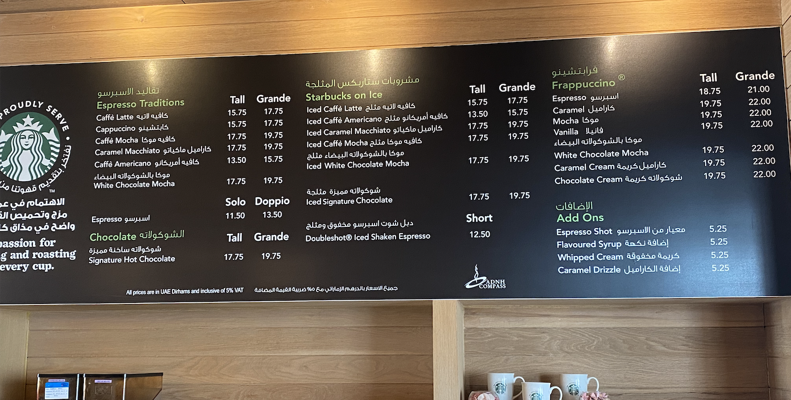
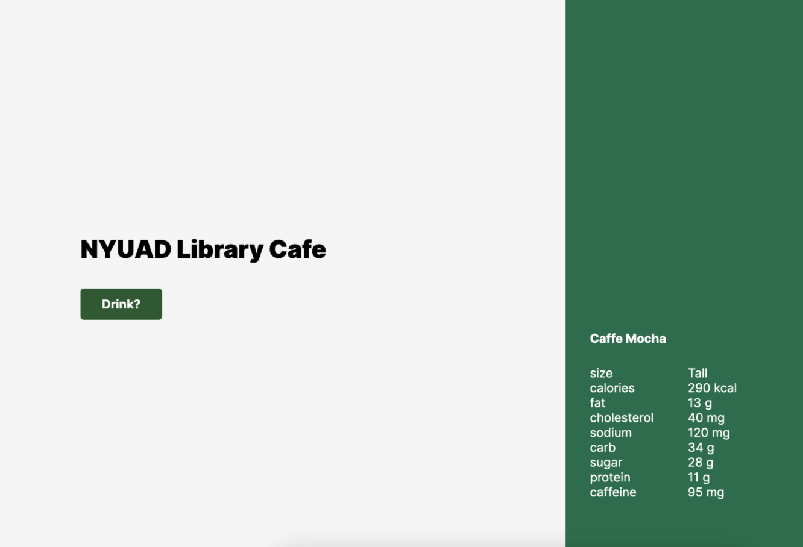
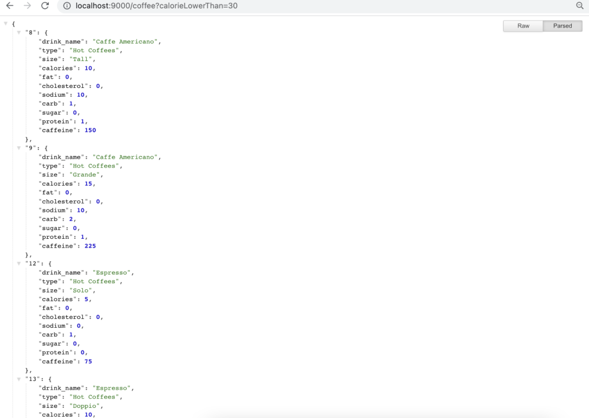

# NYUAD Library Cafe Nutritional Label 

**Title**: Weekly To-do List <br>
**Date**: 3 Mar - 6 Mar 2022 <br>
**Deliverable**: Node-Express app using CSS/HTML/Javascript.node.js  <br>


## Overview


For this week, I created own API that serves JSON file, and made a webpage that fetches the API I created. For this specific project, I wanted to create something that is useful for the community members of NYUAD. On campus, there is a Starbucks library cafe. While there is a menu available with the price, there is no further information about the nutrients. Therefore, I decided to create an API that has the nutritional label for each drink item in the library cafe and have it displayed on the website. 

## Creating a Server 

### Processing Dataset 

The nutritional information for starbucks drinks were found here [Starbucks Nutrition Analysis](https://github.com/yhejazi/starbucks-nutrition/blob/master/data/sbux_nutrition.csv).

This data set includes following nutritional information:
- Drink Name
- type
- calories
- fat
- cholesterol
- sodium
- carb
- sugar
- protein
- caffeine


### CSV file to JSON file

The original data source was in csv format. I used online csv to json file converter to convert the file. I think sorted out the data that is needed for this project. On campus Library Starbucks serves only a few drink that are on the menu below:
I also cleaned language in a way that is easier for the users. For example, in the original file, there was ® sign: **Oatmilk Honey Latte with Starbucks® Blonde Espresso** that is in the official name, but which people do not use when searching for drink. I also removed the extasis on Caffè Latte. 



For example, the drink Caffee Latte's nutritional info is organied as such:

```

let coffeeData = {
  "coffee": 
    [
      {
        "drink_name": "Caffe Latte",
        "type": "Hot Coffees",
        "size": "Tall",
        "calories": 150,
        "fat": 6,
        "cholesterol": 25,
        "sodium": 135,
        "carb": 15,
        "sugar": 14,
        "protein": 10,
        "caffeine": 75
      },
      ]
      }

```

### Workflow

Before I start, I wrote down the workflow.

**To-do List** <br>
1. Find, create, and edit nutritional info data to JSON format (make sure it is formatted correctly)
2. Craete Sever with Express
3. Add JSON format data to index.js file
4. Route html webpage to "/" 
5. connect to specific local host port
6. Create index html landing page
7. create **/random** randomly select drink and show JSON file 
8. create **/coffee** that shows all the existing drink data JSON file
9. Add query to **/coffee** that respond with a JSON of drinks less than a certain calories
10. Add condition so that user asks for coffee with higher calorie, the API should still work
11. Creatre function user can search for specific drink name using params 

## Wireframe


I created a simple wirefram with a section where users can click Coffee? button to receive random coffee with nutritional info. Nutritional info is displayed on the side (right). I used simple white, black color with a highlight of Starbucks Green color. 


### JSON file Structure
The file

### req.query & req.params 
Some of the challenges were making understanding of the concept of **req.query** and **req.params**

### Final Project Demonstration






## Reflection & Evaluation

I want to develop this project by adding price of the beverages to the dataset. On webpage, I want to make a quick survey, either checkbox or user-entry for users to filter the beverage of their choice. I also want to add images for each beverage and have it displayed on the side. Having to npm start for any changes made in index.js file was a bit frustrating. I was wondering if there are any automatic version of this. 

