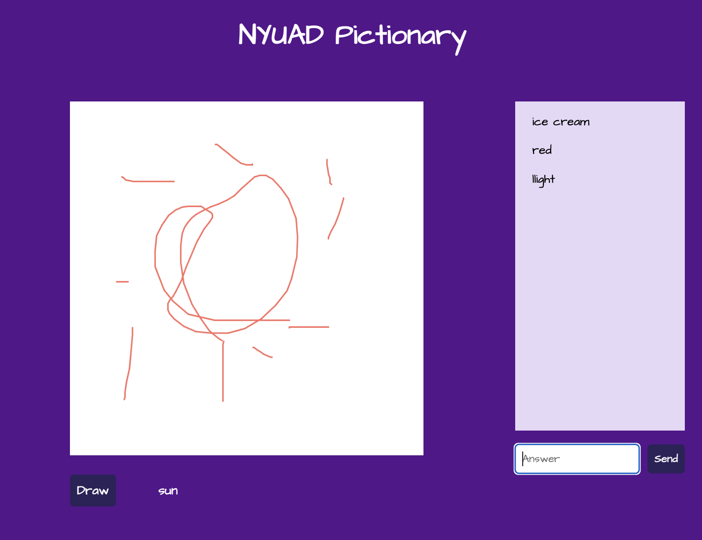

# NYUAD Pictionary

**Title**:NYUAD Pictionary  
**Category**: WEEK 8  
**Date**: 25 Mar 2022  
**Deliverable**: CSS/HTML/Javascript/Node.js/Client-server Connected Game  

[Access Project Here](https://foregoing-shrub-tail.glitch.me)

## Project Overview
Using Node-Express and incorporating socket.io, I created NYUAD Pictionary Game. Pictionary is a fun drawing game where one person draws and other players try to guess what is being drawn. For this game, the words are randomly drawn from the JSON file I created myself. 

## WireFrame

## Two Clients

When a client has drawn the word, drawing word function is disabled to reset of the clients. A person who draws the word can start drawing, or redraw the word if needed. 

## All clients notified correct and move on to next

When a client answers the drawing correctly, everyone will be notified and the game moves to the next round. Again, any player can draw the word by clicking Draw button. 

## When Correct Answer, Inform

## Reflection & What's Next
I am so proud of this project because pictionary is one of my favorite online game that kept me sane during quarantine. How to implementation all the feature was daunting at first. My strategy was to make MVP and elaborate. In the end, I was able to build a playable pictionary game with NYUAD theme. 

Here are some of the improvements I want to make moving forward. 

1) I want to improve this project by adding more words for word.json file. For now, I have only added a few, but 

2) Improve on drawing function. For now, the player can only draw with a default brush stroke and color. By adding customizable color, brush stroke feature, players will be able to illustrate better. The erasor function should be added as well. 

Also, I would like to add a score function where for 
